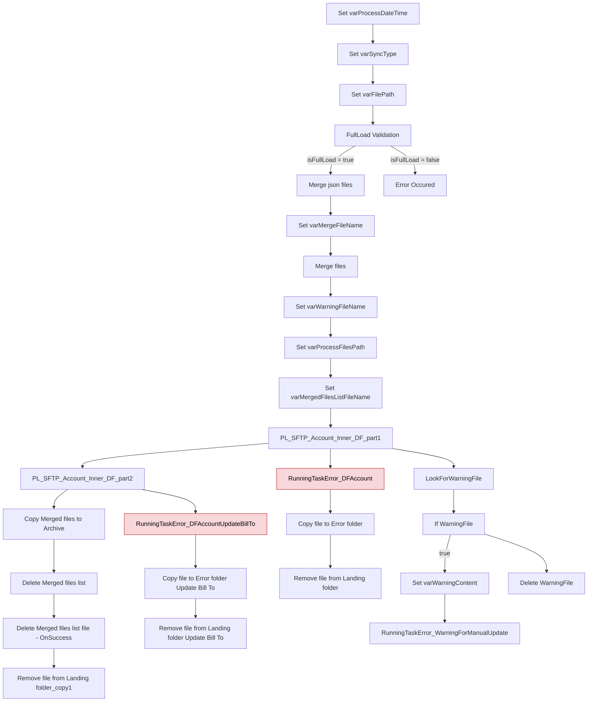

# Analyse du Pipeline Azure Data Factory

## 1. Vue d’ensemble

### 1.1 Nom du pipeline

`PL_IntgrID_Account_M3ToD365_Databricks_Inner`

### 1.2 Objectif

Orchestrer la lecture, la validation, la fusion et le traitement de fichiers JSON de comptes M3 vers un pipeline Databricks / Dynamics 365, en gérant les modes FullLoad et Sync ainsi que les erreurs et les warnings.

### 1.3 Contexte d’exécution

Supporte FullLoad et Sync via le paramètre `isFullLoad`. En mode FullLoad, le pipeline valide le nombre de fichiers JSON et une plage d’identifiants de comptes non synchronisés avant de fusionner les fichiers. Il exécute deux pipelines enfants pour le traitement interne.

### 1.4 Cycle de vie des données

Lecture des fichiers JSON depuis un dossier SFTP de landing → validation FullLoad éventuelle → fusion en un fichier JSON unique → exécution de pipelines internes Databricks → archivage des fichiers traités sur SFTP → nettoyage et gestion des erreurs/warnings.

---

## 2. Architecture du pipeline

### 2.1 Flux d’exécution principal

---

## 3. Activités à haut niveau

| # | Nom de l’activité | Type | Rôle |
|---|---|---|---|
| 1 | Set varProcessDateTime | SetVariable | Génère le timestamp d’exécution en fuseau Eastern Standard Time |
| 2 | Set varSyncType | SetVariable | Détermine si le pipeline utilise le dossier FullLoad ou Sync |
| 3 | Set varFilePath | SetVariable | Construit le chemin SFTP de lecture des fichiers JSON |
| 4 | FullLoad Validation | IfCondition | Valide le mode FullLoad et prépare la fusion des fichiers |
| 5 | Merge json files | IfCondition | Vérifie l’absence d’erreur avant de lancer la fusion |
| 6 | Error Occured | Fail | Arrête le pipeline lorsque la validation échoue |
| 7 | Set varMergeFileName | SetVariable | Construit le nom du fichier JSON fusionné |
| 8 | Merge files | Copy | Agrège les fichiers JSON depuis SFTP en un fichier unique |
| 9 | Set varWarningFileName | SetVariable | Construit le nom du fichier de warning manuels |
| 10 | Set varProcessFilesPath | SetVariable | Construit le dossier ADLS de traitement des fichiers |
| 11 | Set varMergedFilesListFileName | SetVariable | Construit le nom du fichier de liste des fichiers fusionnés |
| 12 | PL_SFTP_Account_Inner_DF_part1 | ExecutePipeline | Exécute le premier pipeline enfant pour traitement interne |
| 13 | PL_SFTP_Account_Inner_DF_part2 | ExecutePipeline | Exécute le second pipeline enfant pour traitement interne |
| 14 | Copy Merged files to Archive | Copy | Archive les fichiers source traités sur SFTP |
| 15 | Delete Merged files list | Delete | Supprime la liste des fichiers fusionnés côté source |
| 16 | Delete Merged files list file - OnSuccess | Delete | Nettoyage conditionnel après succès |
| 17 | Remove file from Landing folder_copy1 | Delete | Nettoie le fichier fusionné du dossier de landing après succès |
| 18 | RunningTaskError_DFAccount | Lookup | Log les erreurs SQL/MariaDB si part1 échoue |
| 19 | Copy file to Error folder | Copy | Copie le fichier fusionné dans l’erreur SFTP après part1 fail |
| 20 | Remove file from Landing folder | Delete | Supprime le fichier source en erreur après part1 fail |
| 21 | RunningTaskError_DFAccountUpdateBillTo | Lookup | Log les erreurs SQL/MariaDB si part2 échoue |
| 22 | Copy file to Error folder Update Bill To | Copy | Copie le fichier fusionné dans l’erreur SFTP après part2 fail |
| 23 | Remove file from Landing folder Update Bill To | Delete | Supprime le fichier source en erreur après part2 fail |
| 24 | LookForWarningFile | Lookup | Recherche un fichier de warning dans ADLS |
| 25 | If WarningFile | IfCondition | Détecte la présence de warnings pour traitement manuel |
| 26 | Set varWarningContent | SetVariable | Prépare le contenu de warning pour logging |
| 27 | RunningTaskError_WarningForManualUpdate | Lookup | Log les warnings dans MariaDB pour action manuelle |
| 28 | Delete WarningFile | Delete | Supprime le fichier warning ADLS après traitement |
| 29 | Delete Merged files list file - OnFail | Delete | Nettoyage conditionnel après échec part2 |
| 30 | Delete Merged files list file - OnDFAccountFail | Delete | Nettoyage conditionnel après échec part1 |

---

## 4. Variables

| Variable | Type | Description |
|---|---|---|
| varProcessDateTime | String | Horodatage de l’exécution en format yyyyMMddTHHmmss EST |
| varFilePath | String | Chemin SFTP de lecture des fichiers JSON à traiter |
| varProcessFilesPath | String | Chemin ADLS de stockage des fichiers de traitement |
| varMergeFileName | String | Nom du fichier JSON fusionné |
| varWarningFileName | String | Nom du fichier JSON de warning manuel |
| varFullLoadFilePath | String | Variable déclarée mais non utilisée directement dans ce pipeline |
| varSyncType | String | Segment de chemin choisi entre FullLoad et Sync |
| varWarningContent | String | Contenu formaté du warning pour logging |
| varError | String | Message d’erreur construit durant la validation FullLoad |
| varInforAPIBaseURL | String | URL de base Infor récupérée depuis Dynamics 365 |
| varMergedFilesListFileName | String | Nom du fichier de liste des fichiers fusionnés |

---

## 5. Paramètres

| Paramètre | Type | Valeur par défaut | Description |
|---|---|---|---|
| sftpPath | string | SyncInforToAzure/ | Racine SFTP d’entrée et de sortie |
| ProcessedPath | string | Archive/ | Sous-dossier pour les fichiers archivés |
| ErrorPath | string | Error/ | Sous-dossier pour les fichiers en erreur |
| adlsContainerName | string | integration | Conteneur ADLS cible |
| adlsProcessFilesPath | string | ToD365/Landing/ | Préfixe ADLS pour les fichiers de processus |
| EntityName | string | Account | Nom de l’entité traitée |
| FullLoadPath | string | FullLoad | Segment de chemin FullLoad |
| SyncPath | string | Sync | Segment de chemin Sync |
| FullLoadNbrFilesRequired | int | 19 | Nombre de fichiers FullLoad attendus |
| RunningTask_LogID | string | 0 | Identifiant de log pour l’enregistrement des erreurs |
| RunningTask_TaskName | string | PL_SFTP_Account | Nom de tâche utilisé par le logging d’erreur |
| AccountsNotSyncMinRangeNbr | string | 690000 | Limite basse de la plage de comptes non synchronisés |
| AccountsNotSyncMaxRangeNbr | string | 699999 | Limite haute de la plage de comptes non synchronisés |
| isFullLoad | bool | false | Indique si le pipeline s’exécute en mode FullLoad |
| ForceRenewInforApiBearerToken | bool | false | Force la régénération du token Infor API |

---

## 6. Flux de données

| Source / Dataset | Destination / Dataset | Technologie / Type |
|---|---|---|
| DS_SFTP_FilePath | DS_SFTP_Filename | JsonSource / JsonSink avec SFTP |
| DS_ADLS_Filename | N/A | JsonSource sur Azure Data Lake Storage |
| DS_D365_ParametersSMGS | N/A | Lookup DynamicsSource pour récupérer InforAPIBaseURL |
| DS_MariaDB | N/A | Lookup MariaDBSource pour logging d’erreurs |
| Pipeline enfant `PL_IntgrID_Account_M3ToD365_Databricks_Part1` | Pipeline enfant `PL_IntgrID_Account_M3ToD365_Databricks_part2` | ExecutePipeline orchestrant le traitement Databricks interne |

---

## 7. Champs mappés

Le fichier JSON fusionné conserve les mêmes champs source, avec une colonne additionnelle `FileName` :

- Action
- AccountNumber
- CustomerName
- M3Status
- BillTo
- Street1
- Street2
- City
- State
- PostalCode
- Country
- Phone
- Extension
- Fax
- PrimaryMarket
- SecondaryMarket
- PurchasingGroup
- AdditionalPurchasingGroup
- NationalGroup
- Manager
- Language
- Kosher
- StoreNumber
- TaxExemption
- TPS
- TVP
- CreditLimit
- OutstandingAmount
- HardBlock
- PaymentTerm
- Warehouse
- DivCompAramark
- FileName

---

## 8. Chemins et emplacements

| Chemin | Usage |
|---|---|
| `SyncInforToAzure/` | Racine SFTP utilisée pour le landing, l’archive et les erreurs |
| `SyncInforToAzure/{EntityName}_{FullLoad|Sync}/` | Dossier de landing des fichiers JSON de comptes |
| `SyncInforToAzure/Error/{EntityName}/{YYYYMM}/` | Dossier d’archivage des fichiers en erreur |
| `SyncInforToAzure/Archive/{EntityName}_{SyncType}/{YYYYMM}/MergedFiles_{timestamp}/` | Dossier d’archive des fichiers traités |
| `integration/ToD365/Landing/{EntityName}/` | Emplacement ADLS pour les fichiers de warning et de traitement |
| `integration/ToD365/Landing/WarningFileName/` | Emplacement ADLS utilisé pour la recherche du fichier de warning |

---

## 9. Notes complémentaires

- La validation FullLoad utilise deux contrôles : le nombre de fichiers JSON attendus (`FullLoadNbrFilesRequired`) et la vérification d’une plage de comptes Infor via API.
- Le pipeline lance deux pipelines enfants pour la partie Databricks/inner, ce qui sépare l’orchestration de la logique de transformation.
- Les branches d’erreur déplacent le fichier fusionné vers un dossier Error et enregistrent le message d’erreur dans MariaDB.
- La détection de warning repose sur un fichier ADLS et active un logging spécifique si des lignes sont présentes.
- Le pipeline contient une variable déclarée non utilisée directement (`varFullLoadFilePath`), ce qui peut être revu pour simplification.
- En mode Sync, la validation FullLoad est contournée et la fusion s’exécute directement.
