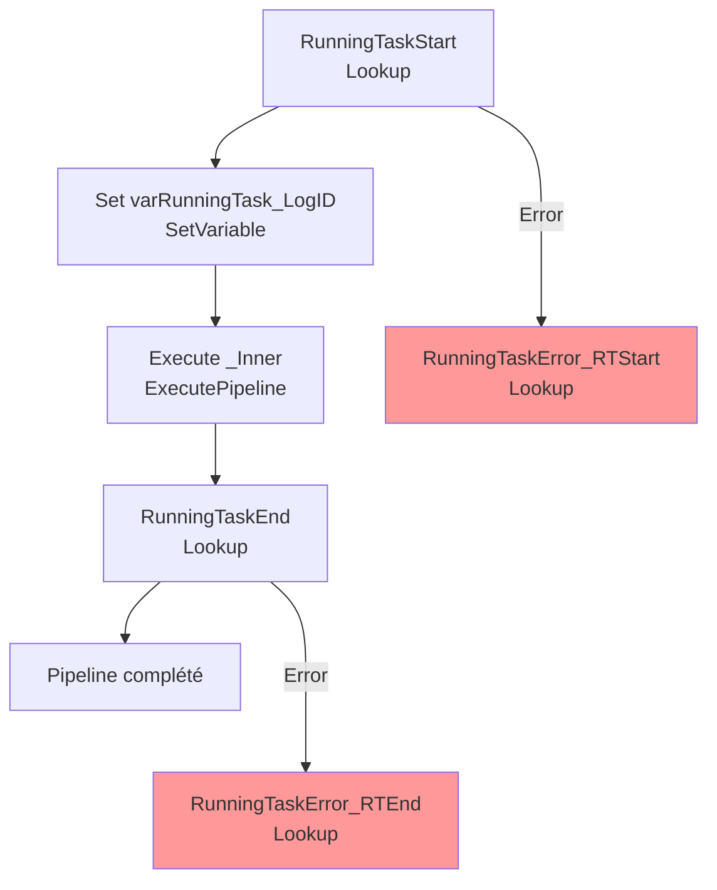

# Analyse du Pipeline Azure Data Factory

## 1. Vue d'ensemble

### 1.1 Nom du pipeline

`PL_IntgrID_AccountCreationTrg_D365ToM3`

### 1.2 Objectif

Orchestrer l'exécution du trigger de création de compte avec gestion complète des logs de tâche. Ce pipeline crée les points de démarrage et fin, initialise un log de tâche dans MariaDB, appelle le pipeline enfant (AccountCreationTrg_Inner), puis finalise le log avec gestion centralisée des erreurs.

### 1.3 Contexte d'exécution

Trigger Single Account : Exécution déclenchée pour un compte spécifique. Logging détaillé en MariaDB. Gestion d'erreur avec enregistrement en base de données.

### 1.4 Cycle de vie des données

Initialisation RunningTask (MariaDB) → Appel pipeline Inner → Finalisation RunningTask (MariaDB) → Logs d'erreurs.

---

## 2. Architecture du pipeline

### 2.1 Flux d'exécution principal

---

## 3. Activités à haut niveau

| # | Nom de l'activité | Type | Rôle |
|---|---|---|---|
| 1 | RunningTaskStart | Lookup | Initialise un log de tâche en cours dans MariaDB via SP_RunningTaskStart |
| 2 | Set varRunningTask_LogID | SetVariable | Capture le LogID retourné pour traçabilité unique |
| 3 | Execute _Inner | ExecutePipeline | Appelle le pipeline enfant (AccountCreationTrg_Inner) avec tous les paramètres |
| 4 | RunningTaskEnd | Lookup | Appelle SP_RunningTaskEnd pour finaliser le log de succès en MariaDB |
| 5 | RunningTaskError_RTStart | Lookup | (En cas d'erreur RunningTaskStart) Enregistre l'erreur en DB |
| 6 | RunningTaskError_RTEnd | Lookup | (En cas d'erreur RunningTaskEnd) Enregistre l'erreur en DB |

---

## 4. Variables

| Variable | Type | Description |
|---|---|---|
| `varRunningTask_LogID` | String | ID du log créé dans MariaDB pour traçabilité de l'exécution |

---

## 5. Paramètres

| Paramètre | Type | Valeur par défaut | Description |
|---|---|---|---|
| `ForceRenewInforApiBearerToken` | Boolean | false | Force la génération d'un nouveau bearer token |
| `CustomerStage_SyncProcessing` | String | Non défini | Stage client D365 pour filtrage (ex: 40 = Ready for Sync) |
| `M3AccountNumber` | String | Non défini | Numéro de compte M3 spécifique à traiter |

---

## 6. Flux de données

| Source | Destination | Technologie | Format |
|---|---|---|---|
| MariaDB / Synapse Analytics | Lookup output | SQL Stored Procedures | JSON |
| Pipeline enfant | ExecutePipeline | ADF Pipeline Call | Parameters |
| MariaDB / Synapse Analytics | Logging | SQL Stored Procedures | N/A |

---

## 7. Champs mappés

**Procédures stockées MariaDB** :

| Procédure | Paramètres | Rôle |
|---|---|---|
| `management.SP_RunningTaskStart` | pipeline name, '0' | Initialise un log, retourne LogID |
| `management.SP_RunningTaskEnd` | pipeline name, LogID | Finalise le log (succès) |
| `management.SP_RunningTaskErrorSynapse` | pipeline name, LogID, statut, Error data | Enregistre une erreur avec détails |

**Paramètres vers pipeline enfant** :

| Paramètre enfant | Valeur |
|---|---|
| `ForceRenewInforApiBearerToken` | `@pipeline().parameters.ForceRenewInforApiBearerToken` |
| `RunningTask_LogID` | `@variables('varRunningTask_LogID')` |
| `RunningTask_TaskName` | `@pipeline().Pipeline` (nom courant) |
| `CustomerStage_SyncProcessing` | `@pipeline().parameters.CustomerStage_SyncProcessing` |
| `M3AccountNumber` | `@pipeline().parameters.M3AccountNumber` |

---

## 8. Chemins et emplacements

| Chemin | Type | Description |
|---|---|---|
| Dataset `DS_MariaDB` | Database | Connexion MariaDB pour procédures stockées |
| `management` schema | Database | Schéma d'administration pour logging |
| `pipeline().Pipeline` | ADF metadata | Nom du pipeline courant |
| `pipeline().RunId` | ADF metadata | ID exécution unique |

---

## 9. Notes complémentaires

### Points d'attention

- **Wrapper de logging** : Ce pipeline est un wrapper orchestrateur autour d'AccountCreationTrg_Inner pour ajouter la gestion de logs MariaDB.
- **Logging centralisé** : Tous les logs transitent par MariaDB (SP_RunningTaskStart, SP_RunningTaskEnd, SP_RunningTaskErrorSynapse) pour audit trail queryable.
- **Timeout court (30 sec)** : Approprié pour les Lookup sur MariaDB (opérations rapides).
- **Pas de retry** : Fiabilité via logging plutôt que retry automatique.
- **Gestion d'erreurs bicouche** : Capture d'erreurs à la fois sur RunningTaskStart et RunningTaskEnd pour identifier le point d'échec.

### Recommandations ADF - Bonnes pratiques

1. **Pattern d'orchestration** : Pattern excellent d'ajout du logging sans modifier le pipeline d'exécution réelle (séparation des responsabilités).
2. **Traceabilité complète** : LogID unique permet de tracer une exécution de début à fin dans MariaDB.
3. **Optimisations suggérées** :
   - Ajouter une **activité Lookup préalable** pour vérifier que le compte M3 existe et est en statut valide avant même de démarrer le RunningTask.
   - Envisager une **activité WebActivity de notification** en cas d'erreur (email, Teams, etc.).
   - Augmenter le **timeout de RunningTaskStart/End** si MariaDB est surchargé (30 sec peut être court).
   - Ajouter un **maximum d'attente** ou **timeout** sur l'ExecutePipeline (actuellement pas défini) pour éviter les attentes infinies en cas de deadlock enfant.
   - Considérer une **archivage** des vieux logs MariaDB pour maintenir la performance des requêtes.
4. **Monitoring** : Requête MariaDB en post-run pour extraire les compteurs succès/erreur pour alerting/reporting.
5. **Escalade** : Pattern de deux RunningTaskError Lookups permet de distinguer les erreurs d'initialisation vs finalisation. Considérer une escalade différenciée (alert vs incident).

