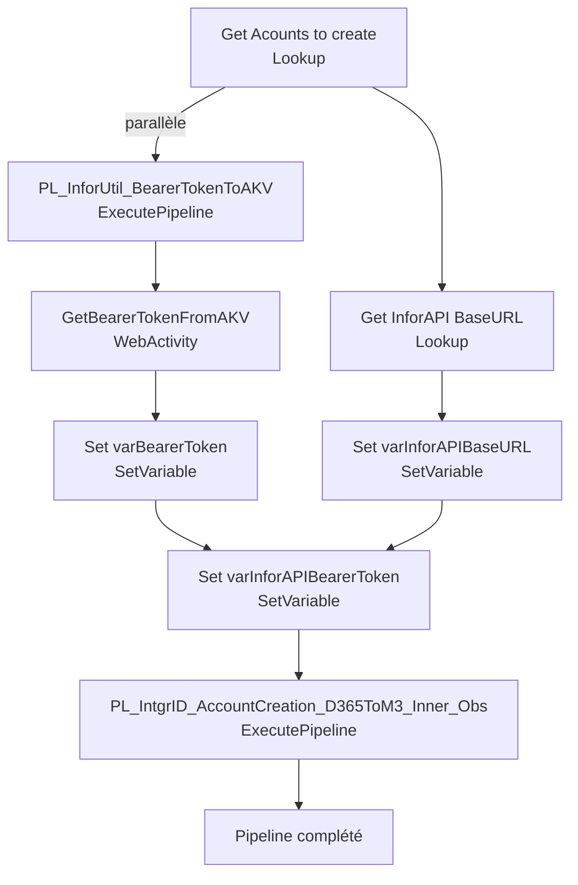

# Analyse du Pipeline Azure Data Factory

## 1. Vue d'ensemble

### 1.1 Nom du pipeline

`PL_IntgrID_AccountCreationTrg_D365ToM3_Inner`

### 1.2 Objectif

Exécuter la création d'un compte spécifique depuis Dynamics 365 vers Infor M3 avec paramètres de trigger. Ce pipeline récupère les données du compte D365 avec tous ses mappages (BillTo, groupes d'achat, segments de marché, division), obtient le bearer token Infor, puis appelle le pipeline de création interne avec tous les paramètres nécessaires.

### 1.3 Contexte d'exécution

Trigger Single Account : Exécution ciblée pour un compte M3 spécifique. Authentification Infor via Bearer Token. Lookup sur D365 avec jointures multiples pour enrichissement des données.

### 1.4 Cycle de vie des données

D365 (Account lookup multi-jointure) → Récupération BaseURL Infor → Bearer Token (AKV) → Transformation paramètres → Appel pipeline Inner pour création.

---

## 2. Architecture du pipeline

### 2.1 Flux d'exécution principal

---

## 3. Activités à haut niveau

| # | Nom de l'activité | Type | Rôle |
|---|---|---|---|
| 1 | Get Acounts to create | Lookup | Requête FetchXML complète sur D365 pour récupérer le compte avec tous les mappages (BillTo, Territory, Markets, Groups, BusinessUnit) |
| 2 | PL_InforUtil_BearerTokenToAKV | ExecutePipeline | Pipeline utilitaire pour générer/rafraîchir le bearer token Infor en Azure Key Vault |
| 3 | GetBearerTokenFromAKV | WebActivity | Récupère le bearer token depuis AKV via Api REST avec authentification MSI |
| 4 | Get InforAPI BaseURL | Lookup | Récupère l'URL de base de l'API Infor depuis la table de paramètres D365 |
| 5 | Set varBearerToken | SetVariable | Stocke le bearer token dans une variable pour passage au pipeline enfant |
| 6 | Set varInforAPIBaseURL | SetVariable | Stocke l'URL de base API dans une variable |
| 7 | Set varInforAPIBearerToken | SetVariable | Combine le type authentification "Bearer " + token pour les headers |
| 8 | PL_IntgrID_AccountCreation_D365ToM3_Inner_Obs | ExecutePipeline | Appelle le pipeline enfant de création réelle du compte avec tous les paramètres |

---

## 4. Variables

| Variable | Type | Description |
|---|---|---|
| `varBearerToken` | String | Bearer token brut depuis AKV (sécurisé) |
| `varInforAPIBaseURL` | String | URL de base de l'API Infor M3 |
| `varInforAPIBearerToken` | String | Valeur complète du header Authorization : "Bearer {token}" |

---

## 5. Paramètres

| Paramètre | Type | Valeur par défaut | Description |
|---|---|---|---|
| `ForceRenewInforApiBearerToken` | Boolean | false | Force la génération d'un nouveau bearer token vs réutilisation |
| `M3AccountNumber` | String | Non défini | Numéro de compte M3 spécifique à traiter |
| `CustomerStage_SyncProcessing` | String | 40 | Stage client D365 pour filtrer les comptes (ex: 40 = Ready for Sync) |

---

## 6. Flux de données

| Source | Destination | Technologie | Format |
|---|---|---|---|
| Dynamics 365 (Account + jointures) | Lookup output | FetchXML Query | JSON |
| Azure Key Vault | WebActivity output | REST MSI Auth | Secret value |
| Dynamics 365 (Parameters) | Lookup output | FetchXML Query | JSON |
| Pipeline enfant | ExecutePipeline | ADF Call | Parameters |

---

## 7. Champs mappés

**FetchXML pour Get Acounts to create** :

| Entité | Alias | Attributs |
|---|---|---|
| account | - | accountid, xrm_amname, ava_m3number, accountnumber, ava_m3status, address2_*, name, tel/fax, xrm_language, ava_*, msdyn_taxexempt, xrm_accounttype |
| account → BillTo | BillTo | ava_m3number (BillTo_m3number) |
| territory → ProfileManager | Territory/SystemUser | ava_m3code, xrm_code, inforid (ProfileManagerid) |
| xrm_primarymarketsegment | PrimaryMarket | xrm_code (PrimaryMarket_m3code) |
| xrm_secondarymarketsegment | SecondaryMarket | xrm_code (SecondaryMarket_m3code) |
| xrm_buyinggroup | BuyingGroup | xrm_code (BuyingGroup_m3code) |
| ava_additionalpurchasinggroup | AdditionalPurchasingGroup | ava_code (AdditionalPurchasingGroup_m3code) |
| xrm_nationalgroup | NationalGroup | xrm_code (NationalGroup_m3code) |
| businessunit | BusinessUnit | xrm_code (BusinessUnit_m3code), ava_companym3 (BusinessUnit_companym3) |

**Paramètres D365** :

| Paramètre | Attribut | Description |
|---|---|---|
| InforAPIBaseURL | ava_value | URL de base pour les appels API Infor M3 |

---

## 8. Chemins et emplacements

| Chemin | Type | Description |
|---|---|---|
| `https://sanimarcdev-kv.vault.azure.net/secrets/InforAPI-BearerToken-Value/?api-version=7.0` | Azure Key Vault | Stockage sécurisé du bearer token |
| Dataset `DS_D365_Account` | D365 | Requête FetchXML Account lookup |
| Dataset `DS_D365_ParametersSMGS` | D365 | Table des paramètres système |

---

## 9. Notes complémentaires

### Points d'attention

- **FetchXML complexe** : Requête avec 8 jointures (link-entity) pour enrichir le compte de tous ses contextes référentiels (BillTo, Territory, Markets, Groups, Division).
- **firstRowOnly** : `firstRowOnly: true` pour la requête Account lookup (retourne 1 seul compte), `firstRowOnly: false` pour Get Acounts to create (retourne tous les comptes du filtre).
- **Filtre FetchXML** : `ava_customerstage = 40` ET `ava_m3number = {M3AccountNumber}` pour isoler le compte spécifique à traiter.
- **secureOutput: true** : La WebActivity GetBearerTokenFromAKV marque la sortie comme sécurisée pour ne pas exposer le token dans les logs ADF.
- **MSI Authentication** : Authentification sans secret statique - bonne pratique de sécurité.

### Recommandations ADF - Bonnes pratiques

1. **Jointures complètes** : Pattern excellent de richissement progressif des données via link-entity. Utilisation de "outer" joins pour gérer les valeurs NULL (comptes sans territory, market, etc.).
2. **Paramètres bien utilisés** : Les paramètres ForceRenewInforApiBearerToken et M3AccountNumber permettent la flexibilité (single account vs batch via orchestrateur parent).
3. **Optimisations suggérées** :
   - Ajouter **caching** du bearer token : ne renouveler que s'il a expiré (implémenter la logique dans le pipeline utilitaire).
   - Ajouter une **validation** en fin de FetchXML : s'assurer que le compte existe et a tous les champs requis avant appel au pipeline enfant.
   - Envisager une **exécution parallèle** si plusieurs comptes doivent être traités (transformer en ForEach et ExecutePipeline parallèle).
   - Ajouter une **activité Until/retry** sur GetBearerTokenFromAKV en cas d'échec réseau.
4. **Linked Services** : Vérifier que le Linked Service D365 a les bonnes permissions pour FetchXML (lecture Account, Territory, BusinessUnit, etc.).
5. **Scalabilité** : Pattern actuel (single account) idéal pour trigger événementiel. Pour batch, réduire les Lookup et utiliser ForEach sur la liste d'entrée.

