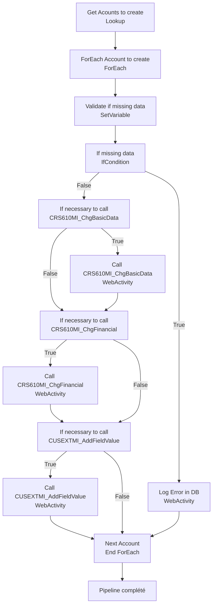

# Analyse du Pipeline Azure Data Factory

## 1. Vue d'ensemble

### 1.1 Nom du pipeline

`PL_IntgrID_AccountCreation_D365ToM3_Inner_Obs`

### 1.2 Objectif

Créer et synchroniser les comptes clients depuis Dynamics 365 vers Infor M3 en appelant les APIs M3 appropriées. Ce pipeline valide les données manquantes, orchestre les appels API multiples (CRS610MI, CUSEXTMI, CRSEXCMI) pour créer/mettre à jour les comptes avec gestion complète des erreurs et données additionnelles.

### 1.3 Contexte d'exécution

Full Load / Delta : Création de comptes avec validation stricte des champs obligatoires. Boucle séquentielle (ForEach) sur chaque compte à créer. Timeout 1h30 par appel API.

### 1.4 Cycle de vie des données

D365 (données de compte) → Validation (champs obligatoires) → Appels API M3 séquentiels → M3 (comptes/adresses mis à jour).

---

## 2. Architecture du pipeline

### 2.1 Flux d'exécution principal

---

## 3. Activités à haut niveau

| # | Nom de l'activité | Type | Rôle |
|---|---|---|---|
| 1 | Get Acounts to create | Lookup | Récupère la liste des comptes D365 en attente de création dans M3 |
| 2 | ForEach Account to create | ForEach | Itère séquentiellement sur chaque compte à traiter |
| 3 | Validate if missing data | SetVariable | Valide la présence des champs obligatoires (Company, AccountType, M3Number, Name, Address) |
| 4 | If missing data | IfCondition | Branching : si erreurs de validation, arrête le traitement du compte |
| 5 | Log Error in DB | WebActivity | Enregistre l'erreur dans la base de données pour traçabilité |
| 6 | If necessary to call CRS610MI_ChgBasicData | IfCondition | Condition : appelle API de mise à jour si champs de base présents |
| 7 | Call CRS610MI_ChgBasicData | WebActivity | Appel API M3 pour mettre à jour les données de base du compte |
| 8 | If necessary to call CRS610MI_ChgFinancial | IfCondition | Condition : appelle API financière si type de compte = Vendor (163650001) |
| 9 | Call CRS610MI_ChgFinancial | WebActivity | Appel API M3 pour mettre à jour les données financières |
| 10 | If necessary to call CUSEXTMI_AddFieldValue_v2 | IfCondition | Condition : ajoute les groupes d'achat additionnels si présents |
| 11 | Call CUSEXTMI_AddFieldValue | WebActivity | Appel API M3 pour ajouter les valeurs de champs additionnels |

---

## 4. Variables

| Variable | Type | Description |
|---|---|---|
| `varError` | String | Accumule les messages d'erreur lors de la validation : champs manquants (Company, Type, Number, Name, Address) |
| `varCustomerNumber` | String | Numéro de client M3 courant dans la boucle ForEach |
| `varInforAPIBaseURL` | String | URL de base de l'API Infor M3 |

---

## 5. Paramètres

| Paramètre | Type | Valeur par défaut | Description |
|---|---|---|---|
| `InforAPIBearerToken` | String | Non défini | Bearer token d'authentification pour les appels API M3 (sécurisé) |
| `CustomerStage_SyncProcessing` | String | Non défini | Stage client D365 utilisé pour filtrer les comptes à traiter |

---

## 6. Flux de données

| Source | Destination | Technologie | Format |
|---|---|---|---|
| Dynamics 365 (Accounts) | Infor M3 API | REST WebActivity | JSON requests/responses |
| Dynamics 365 (Vendors) | Infor M3 API (CRS610MI) | REST WebActivity | JSON |
| Dynamics 365 (AdditionalGroups) | Infor M3 API (CUSEXTMI) | REST WebActivity | JSON |

---

## 7. Champs mappés

**Validation obligatoire** :

| Champ | Source D365 | Condition |
|---|---|---|
| Company M3 | `BusinessUnit_companym3` | Doit être présent et ≠ 0 |
| Account Type | `xrm_accounttype` | Doit être : 163650000, 163650001, ou 163650002 |
| Customer Number | `ava_m3number` | Ne doit pas être vide après trim |
| Customer Name | `name` | Ne doit pas être vide après trim |
| Address Line 1 | `address2_line1` | Ne doit pas être vide après trim |

**Appels API M3** :

- **CRS610MI_ChgBasicData** : Mise à jour des données de base (localité, représentant, etc.)
- **CRS610MI_ChgFinancial** : Mise à jour des données financières (CORG, COR2, VTCD pour exonération fiscale)
- **CUSEXTMI_AddFieldValue** : Ajout du groupe d'achat additionnel (field A030)

---

## 8. Chemins et emplacements

| Chemin | Type | Description |
|---|---|---|
| Infor M3 API endpoint | REST | Variable `varInforAPIBaseURL` |
| `M3/m3api-rest/v2/execute/CRS610MI/...` | REST | Endpoints pour opérations compte M3 |
| `M3/m3api-rest/v2/execute/CUSEXTMI/...` | REST | Endpoints pour champs étendus M3 |

---

## 9. Notes complémentaires

### Points d'attention

- **Validation stricte** : Chaque compte est validé pour 5 champs obligatoires avant tout appel API. Erreur immédiate si validation échoue.
- **Ordre des appels API** : ChgBasicData → ChgFinancial (si Vendor) → AddFieldValue (si groupe additionnel)
- **Timeout 1h30** : Approprié pour les appels API en cas de haute charge serveur M3.
- **Séquentiel ForEach** : `isSequential: true` - traite un compte à la fois pour éviter les race conditions.
- **Conditions imbriquées** : Utilisation d'IfCondition pour chaque appel API permet de sauter les appels non-nécessaires et éviter les erreurs.
- **Message d'erreur concaténé** : La variable `varError` accumule tous les messages manquants (champs multiples) pour diagnostic global.

### Recommandations ADF - Bonnes pratiques

1. **Validation complète** : Pattern d'IfCondition pour chaque appel API est robuste et évite les faux appels.
2. **Gestion d'erreur** : Logging en DB pour chaque compte en erreur est bon pour traçabilité.
3. **Optimisations suggérées** :
   - Envisager une exécution **parallèle** (ForEach avec `isSequential: false`) si M3 peut gérer les appels concurrents pour réduire le temps total.
   - Ajouter un **Lookup/Until avec retry** sur chaque WebActivity pour gérer les timeouts réseau temporaires.
   - Ajouter une activité **CountLog** pour tracker le nombre de comptes créés/échoués.
   - Considérer le **batch mode** pour les appels API M3 si disponible (réduirait le nombre d'appels).
4. **Paramètres sécurisés** : Le `InforAPIBearerToken` doit être marqué comme `secureInput: true` pour ne pas être exposé dans les logs.
5. **Linked Services** : Documenter les retry policies au niveau des WebActivity Linked Services pour améliorer la robustesse.

