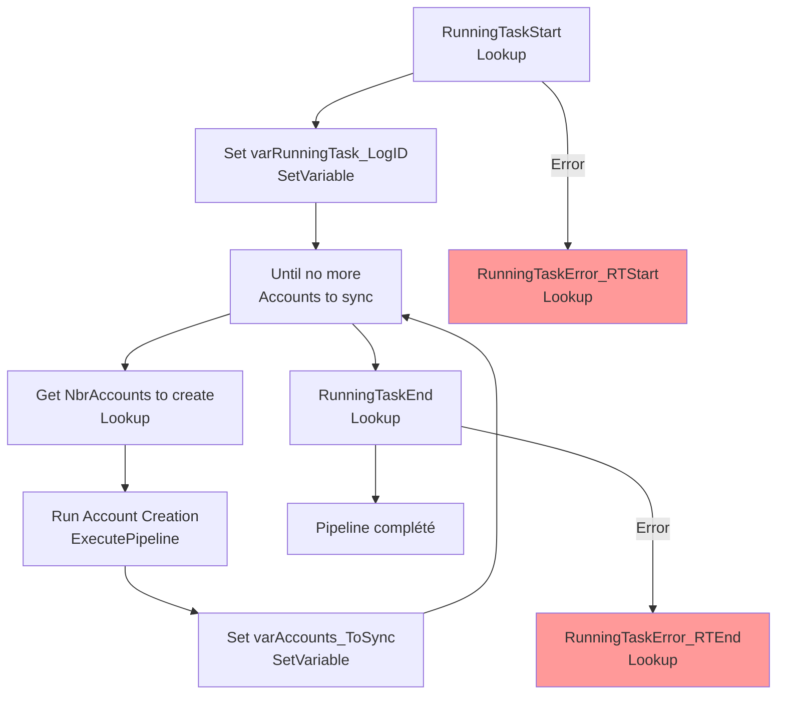

# Analyse du Pipeline Azure Data Factory

## 1. Vue d'ensemble

### 1.1 Nom du pipeline

`PL_IntgrID_AccountCreation_D365ToM3_Obs`

### 1.2 Objectif

Orchestrer l'exécution du pipeline de création de comptes avec gestion complète des logs de tâche en cours et gestion d'erreurs centralisée. Ce pipeline crée les points de départ et fin pour tracer l'exécution globale, effectue une boucle "Until" pour traiter les comptes par batches, et enregistre tous les erreurs dans la base de données de gestion.

### 1.3 Contexte d'exécution

Full Load / Delta avec logging détaillé : Enregistrement des tâches en cours (Running Task) via MariaDB. Boucle Until pour repétition des syncs "non-traités". Gestion d'erreurs avec logging centralisé.

### 1.4 Cycle de vie des données

Initialisation RunningTask → Boucle de traitement (Until) → Enregistrement fin (RunningTaskEnd) → Logs d'erreurs (MariaDB).

---

## 2. Architecture du pipeline

### 2.1 Flux d'exécution principal

---

## 3. Activités à haut niveau

| # | Nom de l'activité | Type | Rôle |
|---|---|---|---|
| 1 | RunningTaskStart | Lookup | Initialise un log de tâche en cours dans MariaDB via SP_RunningTaskStart |
| 2 | Set varRunningTask_LogID | SetVariable | Capture le LogID retourné pour traçabilité de la tâche |
| 3 | Until no more Accounts to sync | Until | Boucle jusqu'à ce qu'aucun compte ne soit en attente de création |
| 4 | Get NbrAccounts to create | Lookup | Requête pour compter les comptes en attente de création dans la plage de statuts |
| 5 | Run Account Creation | ExecutePipeline | Appelle le pipeline enfant de création (Inner) pour un batch de comptes |
| 6 | Set varAccounts_ToSync | SetVariable | Met à jour le compteur pour la condition de boucle Until |
| 7 | RunningTaskEnd | Lookup | Appelle la procédure SP_RunningTaskEnd dans MariaDB pour finaliser le log |
| 8 | RunningTaskError_RTStart | Lookup | (En cas d'erreur RunningTaskStart) Enregistre l'erreur de démarrage en DB |
| 9 | RunningTaskError_RTEnd | Lookup | (En cas d'erreur RunningTaskEnd) Enregistre l'erreur de fin en DB |

---

## 4. Variables

| Variable | Type | Description |
|---|---|---|
| `varRunningTask_LogID` | String | ID du log de tâche créé dans MariaDB pour traçabilité globale |
| `varAccounts_ToSync` | String/Integer | Nombre de comptes encore à traiter pour la condition d'arrêt Until |

---

## 5. Paramètres

| Paramètre | Type | Valeur par défaut | Description |
|---|---|---|---|
| Aucun | - | - | Ce pipeline est appelé sans paramètres (configuration via Lookup/MariaDB) |

---

## 6. Flux de données

| Source | Destination | Technologie | Format |
|---|---|---|---|
| MariaDB / Synapse Analytics | Lookup Output | SQL Query | JSON (count result) |
| Pipeline enfant | ExecutePipeline | ADF Pipeline Call | Parameters |
| MariaDB / Synapse Analytics | Logging | SQL Stored Procedures | N/A |

---

## 7. Champs mappés

**Procédures stockées MariaDB** :

| Procédure | Paramètres | Rôle |
|---|---|---|
| `management.SP_RunningTaskStart` | pipeline name | Crée un log de tâche, retourne LogID |
| `management.SP_RunningTaskEnd` | pipeline name, LogID | Finalise le log de tâche (succès) |
| `management.SP_RunningTaskErrorSynapse` | pipeline name, LogID, Error details, Pipeline RunId | Enregistre une erreur dans les logs |

---

## 8. Chemins et emplacements

| Chemin | Type | Description |
|---|---|---|
| Dataset `DS_MariaDB` | Database | Connexion MariaDB pour stored procedures |
| `management` schema | Database | Schéma d'administration pour logging |
| `pipeline().Pipeline` | ADF metadata | Nom du pipeline courant (utilisé dans les logs) |
| `pipeline().RunId` | ADF metadata | ID unique d'exécution du pipeline ADF |

---

## 9. Notes complémentaires

### Points d'attention

- **Logging robuste** : Utilisation de procédures stockées MariaDB pour centraliser les logs. Chaque exécution génère un LogID pour traçabilité complète.
- **Boucle Until** : Continue tant que des comptes sont en attente. Condition d'arrêt basée sur le compte de comptes retourné par Lookup.
- **Gestion d'erreurs** : Deux branches d'erreur explicites (RunningTaskError_RTStart, RunningTaskError_RTEnd) pour capturer les failures et les enregistrer.
- **Timeout court (30 sec)** : Approprié pour les Lookup sur MariaDB (requêtes rapides sur petit dataset de logs).
- **Pas de retry** : Recherche de fiabilité via logging plutôt que retry - bonne approche pour les tâches de gestion.

### Recommandations ADF - Bonnes pratiques

1. **Logging centralisé** : Pattern excellent avec usage de MariaDB pour tous les logs - audit trail complet et queryable.
2. **Until Loop** : Bonne pratique pour traiter des batches tant que la condition n'est pas satisfaite.
3. **Optimisations suggérées** :
   - Augmenter le **timeout de la boucle Until** si elle peut prendre >1h (ajouter `timeout` à la configuration).
   - Ajouter un **maximum d'itérations** à la boucle Until pour éviter les boucles infinies en cas de bug.
   - Envisager une **activité WebActivity** pour notifier les opérateurs en cas d'erreur (au lieu de Lookup d'erreur).
   - Ajouter des **métriques/compteurs** (SetVariable) pour tracker la progression (comptes traités, erreurs, temps écoulé).
4. **Monitoring** : Requête MariaDB en post-exécution pour extraire les compteurs de succès/erreur pour monitoring du factory.
5. **Gestion d'erreurs** : Considérer une activité centralisée d'erreur avant la fin du pipeline pour résumer les issues.

