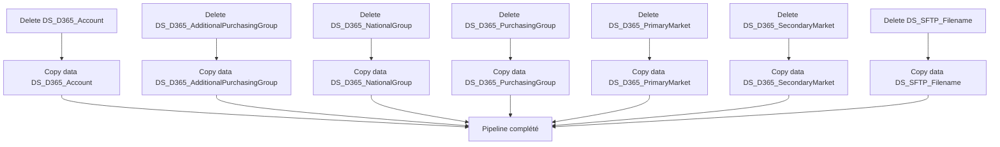

# Analyse du Pipeline Azure Data Factory

## 1. Vue d'ensemble

### 1.1 Nom du pipeline

`PL_IntgrID_Account_M3ToD365_Databricks_Part1`

### 1.2 Objectif

Extraire et copier les données de comptes clients depuis Dynamics 365 vers Azure Data Lake Storage en format Parquet. Ce pipeline orchestre la synchronisation des données de référence (comptes, groupes d'achat, segments de marché) depuis D365 vers ADLS pour traitement ultérieur par Databricks.

### 1.3 Contexte d'exécution

Full Load : Exécution complète de toutes les copies de données de référence depuis D365 vers ADLS. Timeout : 12 heures par activité. Pas de retry.

### 1.4 Cycle de vie des données

Source (Dynamics 365) → Suppression ADLS → Copie des données → Stockage Parquet (ADLS) → Traitement Databricks en étape 2.

---

## 2. Architecture du pipeline

### 2.1 Flux d'exécution principal

---

## 3. Activités à haut niveau

| # | Nom de l'activité | Type | Rôle |
|---|---|---|---|
| 1 | Delete DS_D365_Account | Delete | Suppression préalable des données Parquet existantes pour la table Account |
| 2 | Copy data DS_D365_Account | Copy | Copie des comptes clients depuis D365 vers ADLS en format Parquet |
| 3 | Delete DS_D365_AdditionalPurchasingGroup | Delete | Suppression des données Parquet existantes pour les groupes d'achat additionnels |
| 4 | Copy data DS_D365_AdditionalPurchasingGroup | Copy | Copie des groupes d'achat additionnels depuis D365 vers ADLS |
| 5 | Delete DS_D365_NationalGroup | Delete | Suppression des données Parquet existantes pour les groupes nationaux |
| 6 | Copy data DS_D365_NationalGroup | Copy | Copie des groupes nationaux depuis D365 vers ADLS |
| 7 | Delete DS_D365_PurchasingGroup | Delete | Suppression des données Parquet existantes pour les groupes d'achat |
| 8 | Copy data DS_D365_PurchasingGroup | Copy | Copie des groupes d'achat depuis D365 vers ADLS |
| 9 | Delete DS_D365_PrimaryMarket | Delete | Suppression des données Parquet existantes pour les marchés primaires |
| 10 | Copy data DS_D365_PrimaryMarket | Copy | Copie des segments de marché primaires depuis D365 vers ADLS |
| 11 | Delete DS_D365_SecondaryMarket | Delete | Suppression des données Parquet existantes pour les marchés secondaires |
| 12 | Copy data DS_D365_SecondaryMarket | Copy | Copie des segments de marché secondaires depuis D365 vers ADLS |
| 13 | Delete DS_SFTP_Filename | Delete | Suppression des données Parquet existantes pour les noms de fichiers SFTP |
| 14 | Copy data DS_SFTP_Filename | Copy | Copie des métadonnées de fichiers SFTP depuis D365 vers ADLS |

---

## 4. Variables

| Variable | Type | Description |
|---|---|---|
| Aucune | - | Ce pipeline n'utilise pas de variables explicites |

---

## 5. Paramètres

| Paramètre | Type | Valeur par défaut | Description |
|---|---|---|---|
| Aucun | - | - | Ce pipeline n'utilise pas de paramètres d'entrée |

---

## 6. Flux de données

| Source | Destination | Technologie | Format |
|---|---|---|---|
| Dynamics 365 (Accounts, Ref Data) | Azure Data Lake Storage | CopyActivity + AzureBlobFS | Parquet |
| SFTP (Metadata) | Azure Data Lake Storage | CopyActivity + AzureBlobFS | Parquet |

---

## 7. Champs mappés

Les champs suivants sont mappés depuis les sources vers Parquet :

**Compte (Account)** :
- accountid, accountnumber, name, address, contact info

**Groupes d'achat** :
- ID, Code, Name (ava_code, ava_name pour AdditionalPurchasingGroup; xrm_code, xrm_name pour PurchasingGroup)

**Segments de marché** :
- ID, Code, Name (xrm_code, xrm_name)

---

## 8. Chemins et emplacements

| Chemin | Type | Description |
|---|---|---|
| `DS_ADLS_Parquet_D365_Account` | ADLS2 | Stockage des comptes Client en Parquet |
| `DS_ADLS_Parquet_D365_AdditionalPurchasingGroup` | ADLS2 | Stockage des groupes d'achat additionnels |
| `DS_ADLS_Parquet_D365_NationalGroup` | ADLS2 | Stockage des groupes nationaux |
| `DS_ADLS_Parquet_D365_PurchasingGroup` | ADLS2 | Stockage des groupes d'achat |
| `DS_ADLS_Parquet_D365_PrimaryMarket` | ADLS2 | Stockage des marchés primaires |
| `DS_ADLS_Parquet_D365_SecondaryMarket` | ADLS2 | Stockage des marchés secondaires |
| `DS_ADLS_Parquet_SFTP_Filename` | ADLS2 | Stockage des métadonnées SFTP |

---

## 9. Notes complémentaires

### Points d'attention

- **Dépendances séquentielles** : Chaque activité Copy dépend de l'activité Delete correspondante pour garantir un nettoyage préalable.
- **Timeout** : Configuration de 12 heures (0.12:00:00) pour toutes les activités Copy - à ajuster selon le volume de données.
- **FlattenHierarchy** : Utilisation de copyBehavior avec FlattenHierarchy pour simplifier la structure des fichiers Parquet.
- **Pas de Staging** : enableStaging=false pour réduire les coûts mais augmente la pression réseau.
- **Requêtes FetchXML** : Certaines entités utilisent des requêtes FetchXML pour filtrer les données (ex. AdditionalPurchasingGroup, NationalGroup).

### Recommandations ADF - Bonnes pratiques

1. **Nommage explicite** : Les noms d'activités sont clairs (Copy data vs Delete), facile à tracer dans les logs.
2. **Pattern de suppression/copie** : Bon pattern pour garantir la fraîcheur des données à chaque exécution (idempotent).
3. **Optimisations suggérées** :
   - Envisager des exécutions parallèles de copie pour les entités indépendantes (réduire la durée totale).
   - Ajouter une activité de validation ou de comptage post-copie pour garantir l'intégrité.
   - Documenter les requêtes FetchXML complexes dans les linked services pour faciliter la maintenance.
   
4. **Monitoring** : Ajouter des activités WebHook ou Lookup pour tracker les comptes de lignes copiés et vérifier les anomalies.

