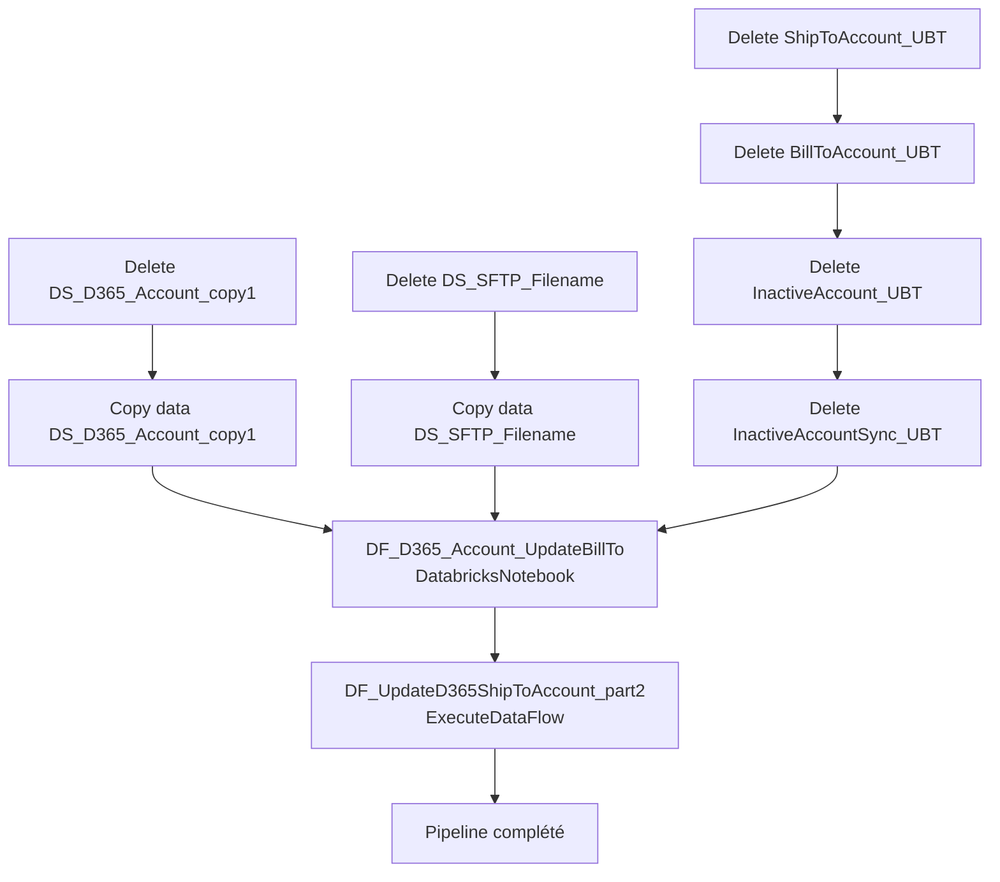

# Analyse du Pipeline Azure Data Factory

## 1. Vue d'ensemble

### 1.1 Nom du pipeline

`PL_IntgrID_Account_M3ToD365_Databricks_part2`

### 1.2 Objectif

Exécuter les notebooks Databricks pour transformer les données de comptes clients et mettre à jour les colonnes de recherche dans Dynamics 365. Ce pipeline orchestre la synchronisation des adresses de facturation et d'expédition après traitement par Databricks.

### 1.3 Contexte d'exécution

Full Load / Delta Sync : Exécution des transformations Databricks et mise à jour des champs de recherche D365. Timeout : 12h pour Copy, 1h pour ExecuteDataFlow. Pas de retry.

### 1.4 Cycle de vie des données

Données Parquet ADLS → Notebook Databricks (transformation) → Données transformées ADLS → DataFlow D365 (mise à jour des lookup) → D365 mis à jour.

---

## 2. Architecture du pipeline

### 2.1 Flux d'exécution principal

---

## 3. Activités à haut niveau

| # | Nom de l'activité | Type | Rôle |
|---|---|---|---|
| 1 | Delete DS_D365_Account_copy1 | Delete | Suppression des données Parquet existantes pour la copie Account |
| 2 | Copy data DS_D365_Account_copy1 | Copy | Copie des comptes clients D365 vers ADLS (copie pour traitement) |
| 3 | Delete DS_SFTP_Filename | Delete | Suppression des métadonnées SFTP précédentes |
| 4 | Copy data DS_SFTP_Filename | Copy | Copie des métadonnées SFTP depuis D365 vers ADLS |
| 5 | Delete DS_ADLS_Parquet_SFTP_ShipToAccount_UBT | Delete | Suppression des données de ShipTo antérieures |
| 6 | Delete DS_ADLS_Parquet_SFTP_BillToAccount_UBT | Delete | Suppression des données de BillTo antérieures |
| 7 | Delete DS_ADLS_Parquet_SFTP_InactiveAccount_UBT | Delete | Suppression des données de comptes inactifs antérieures |
| 8 | Delete DS_ADLS_Parquet_SFTP_InactiveAccountSync_UBT | Delete | Suppression des données de sync comptes inactifs antérieures |
| 9 | DF_D365_Account_UpdateBillTo | DatabricksNotebook | Exécution du notebook Databricks pour synchronisation et mise à jour des adresses de facturation |
| 10 | DF_UpdateD365ShipToAccount_part2 | ExecuteDataFlow | Exécute ADF DataFlow pour mettre à jour les colonnes de recherche ShipTo dans D365 |

---

## 4. Variables

| Variable | Type | Description |
|---|---|---|
| Aucune | - | Ce pipeline n'utilise pas de variables explicites |

---

## 5. Paramètres

| Paramètre | Type | Valeur par défaut | Description |
|---|---|---|---|
| `df_SyncType` | String | Non défini | Type de synchronisation (Full Load ou Delta) à passer au notebook Databricks |

---

## 6. Flux de données

| Source | Destination | Technologie | Format |
|---|---|---|---|
| ADLS Parquet (Account) | Databricks | DatabricksNotebook | Parquet |
| Databricks (résultats) | ADLS Parquet (ShipTo/BillTo) | Databricks Workspace | Parquet |
| ADLS Parquet (ShipTo/BillTo) | Dynamics 365 | ExecuteDataFlow | D365 Entities |

---

## 7. Champs mappés

**Databricks Notebook (`D365_Account_Sync_UpdateBillTo`)** traite les mappages suivants :

- **Entrée** : Comptes D365 + métadonnées SFTP
- **Traitement** : Logique de mappage des adresses de facturation, validation des références croisées
- **Sortie** : 
  - ShipToAccount_UBT (Ship To Account Updates)
  - BillToAccount_UBT (Bill To Account Updates)
  - InactiveAccount_UBT (Accounts inactifs)
  - InactiveAccountSync_UBT (Sync logs pour comptes inactifs)

---

## 8. Chemins et emplacements

| Chemin | Type | Description |
|---|---|---|
| `/Shared/PL_SFTP_Account/D365_Account_Sync_UpdateBillTo` | Databricks | Notebook Databricks pour transformation |
| `DS_ADLS_Parquet_D365_Account` | ADLS2 | Comptes clients à traiter |
| `DS_ADLS_Parquet_SFTP_ShipToAccount_UBT` | ADLS2 | Résultats UBT (Ship To) |
| `DS_ADLS_Parquet_SFTP_BillToAccount_UBT` | ADLS2 | Résultats UBT (Bill To) |
| `DS_ADLS_Parquet_SFTP_InactiveAccount_UBT` | ADLS2 | Comptes inactifs détectés |
| `DS_ADLS_Parquet_SFTP_InactiveAccountSync_UBT` | ADLS2 | Logs de sync des comptes inactifs |
| `DF_SINK_UpdateD365ShipToAccount_UBT` | D365 DataFlow | Mise à jour des lookup ShipTo dans D365 |

---

## 9. Notes complémentaires

### Points d'attention

- **Dépendances Databricks** : Le notebook Databricks dépend de 6 autres activités Delete pour garantir un état propre. Configuration complète avec Workspace URL et Cluster ID.
- **Cluster externe** : Utilise un cluster Databricks externe (`0904-131848-gii7oip2`) avec URL spécifique : `https://adb-84203895327192.12.azuredatabricks.net`.
- **ExecuteDataFlow** : Utilise un runtime d'intégration `30minTTL-small` avec trace level "Fine" pour débogger les problèmes.
- **Paramètres du Notebook** : Le paramètre `df_SyncType` du pipeline est passé en `baseParameters` au notebook.
- **Timeout long** : 1h pour ExecuteDataFlow peut indiquer un volume de données important ou une logique de transformation complexe.

### Recommandations ADF - Bonnes pratiques

1. **Parallélisation améliorable** : Les activités Delete (1-5) pourraient s'exécuter en parallèle au lieu de séquentiellement pour réduire le temps global.
2. **Ordre des dépendances** : Structure logique - Delete + Copy, puis Databricks, puis DataFlow update.
3. **Optimisations suggérées** :
   - Ajouter des activités Until pour retry automatique en cas d'échec Databricks/DataFlow.
   - Logging explicite : inclure des activités WebActivity pour tracker le statut du notebook et du DataFlow.
   - Séparer éventuellement les 4 Delete en une seule activité Delete en boucle (ForEach) pour maintainability.
4. **Monitoring Databricks** : Envisager l'ajout de métriques/alertes sur l'exécution du notebook (temps, nombre de lignes traitées).
5. **Linked Service paramétré** : Le Databricsk Workspace est configuré avec paramètres (URL, Cluster ID) - bon pour multi-environnement.

