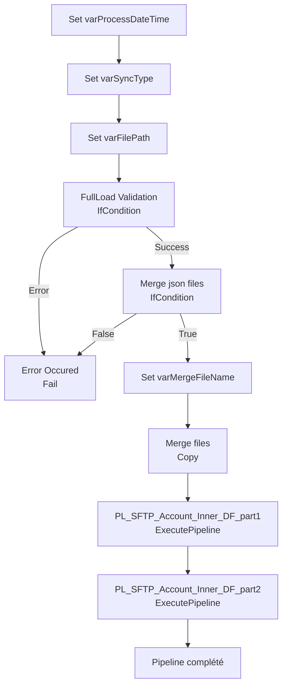

# Analyse du Pipeline Azure Data Factory

## 1. Vue d'ensemble

### 1.1 Nom du pipeline

`PL_IntgrID_Account_M3ToD365_Inner`

### 1.2 Objectif

Orchestrer la fusion de fichiers JSON depuis SFTP et la validation des données de comptes clients. Ce pipeline coordonne le traitement multiniveaux via appels à pipelines enfants pour synchroniser les comptes de M3 vers D365 avec transformations Databricks.

### 1.3 Contexte d'exécution

Full Load / Delta Sync : Fusion des fichiers JSON multiples depuis SFTP avec validation d'intégrité. Modes d'exécution paramétrés (SyncType). Timeout : 12h.

### 1.4 Cycle de vie des données

Fichiers SFTP (JSON) → Validation → Fusion (MergeFiles) → Fichier consolidé → Pipelines enfants (Part1, Part2).

---

## 2. Architecture du pipeline

### 2.1 Flux d'exécution principal

---

## 3. Activités à haut niveau

| # | Nom de l'activité | Type | Rôle |
|---|---|---|---|
| 1 | Set varProcessDateTime | SetVariable | Initialise la variable de timestamp UTC (Eastern Standard Time) pour traçabilité |
| 2 | Set varSyncType | SetVariable | Définit le type de synchronisation (Full Load ou Delta) depuis paramètre |
| 3 | Set varFilePath | SetVariable | Construit le chemin SFTP source pour récupération des fichiers |
| 4 | FullLoad Validation | IfCondition | Valide que le nombre de fichiers requis est présent avant fusion |
| 5 | Error Occured | Fail | Signale une erreur si validation échoue |
| 6 | Merge json files | IfCondition | Vérifie absence d'erreur avant de procéder à la fusion |
| 7 | Set varMergeFileName | SetVariable | Construit le nom du fichier de fusion consolidé |
| 8 | Merge files | Copy | Fusionne les fichiers JSON multiples en un seul fichier sur SFTP |
| 9 | PL_SFTP_Account_Inner_DF_part1 | ExecutePipeline | Exécute le pipeline Part1 (extraction D365 vers ADLS) |
| 10 | PL_SFTP_Account_Inner_DF_part2 | ExecutePipeline | Exécute le pipeline Part2 (transformation Databricks) |

---

## 4. Variables

| Variable | Type | Description |
|---|---|---|
| `varProcessDateTime` | String | Timestamp UTC au format yyyyMMddTHHmmss pour traçabilité unique de chaque exécution |
| `varSyncType` | String | Type de synchronisation : "FullLoad" ou "Delta" |
| `varFilePath` | String | Chemin SFTP source des fichiers JSON à fusionner |
| `varError` | String | Capture les messages d'erreur de validation (vide si succès) |
| `varMergeFileName` | String | Nom du fichier consolidé : `{EntityName}Merge_{ProcessDateTime}.json` |

---

## 5. Paramètres

| Paramètre | Type | Valeur par défaut | Description |
|---|---|---|---|
| `EntityName` | String | Non défini | Nom de l'entité métier à traiter (ex: "Account") |
| `SyncType` | String | Non défini | Type de synchronisation : "FullLoad" ou "Delta" |
| `SftpSourcePath` | String | Non défini | Chemin SFTP source des fichiers JSON |

---

## 6. Flux de données

| Source | Destination | Technologie | Format |
|---|---|---|---|
| SFTP (fichiers JSON multiples) | SFTP (fichier consolidé) | Copy Activity + Merge | JSON |
| SFTP (fusion) | Pipelines enfants | ExecutePipeline | JSON (paramètres) |

---

## 7. Champs mappés

Les champs suivants sont mappés lors de la fusion JSON :

| Champ source | Champ destination | Rôle |
|---|---|---|
| `$['Action']` | `$['Action']` | Type d'action (Create, Update, Delete) |
| `$['AccountNumber']` | `$['AccountNumber']` | Numéro de compte M3 |
| `$['CustomerName']` | `$['CustomerName']` | Nom du client |
| `$['M3Status']` | `$['M3Status']` | Statut dans M3 |
| `$['BillTo']` | `$['BillTo']` | Adresse de facturation |
| `$['Street1']` | `$['Street1']` | Rue 1 |
| `$['Street2']` | `$['Street2']` | Rue 2 |
| `$['City']` | `$['City']` | Ville |
| `$['State']` | `$['State']` | État/Province |
| Métadonnées | `FileName` | Colonne additionnelle $$FILEPATH pour traçabilité |

---

## 8. Chemins et emplacements

| Chemin | Type | Description |
|---|---|---|
| `@{pipeline().parameters.SftpSourcePath}` | SFTP | Répertoire source contenant les fichiers JSON |
| `@{concat(..., variables('varMergeFileName'))}` | SFTP | Fichier consolidé produit |
| Datasets source/sink | SFTP + Merge | Configured storeSettings avec SftpReadSettings/SftpWriteSettings |

---

## 9. Notes complémentaires

### Points d'attention

- **Validation stricte** : L'activité IfCondition "FullLoad Validation" vérifie que le nombre exact de fichiers requis est présent avant fusion. Description : "Need to have exactly the number on files required to do the merge."
- **MergeFiles copyBehavior** : Fusion des fichiers JSON en un seul fichier avec `operationTimeout: 01:00:00` et `useTempFileRename: true` pour assurer l'atomicité.
- **Traçabilité** : Ajout automatique de la colonne `FileName` ($$FILEPATH) pour identifier l'origine de chaque ligne lors de la fusion.
- **Erreur propre** : Si une erreur survient pendant la validation ou fusion, l'activité "Error Occured" arrête le pipeline avec code 500 et message d'erreur explicite.
- **Exécution en cascade** : Part1 et Part2 s'exécutent séquentiellement (Part2 dépend de Part1) pour garantir l'ordre correct.

### Recommandations ADF - Bonnes pratiques

1. **Variables bien utilisées** : Les variables capturent de l'état dynamique (timestamp, chemin, erreur) - pattern correct.
2. **Validation explicite** : La 1ère activité IfCondition pour "FullLoad Validation" est bonne pratique pour garantir l'intégrité des inputs.
3. **Optimisations suggérées** :
   - Ajouter une activité Lookup avant FullLoad Validation pour compter le nombre de fichiers et valider dynamiquement.
   - Documenter les conditions attendues dans la validation (nombre exact de fichiers requis).
   - Envisager une activité WebActivity pour notifier en cas d'erreur avant l'arrêt du pipeline.
   - Ajouter des logiques de retry ou UntilCondition pour relancer automatiquement si la fusion échoue temporairement.
4. **Paramètres d'entrée** : Bien paramétrisé pour multi-entité (EntityName, SyncType, SftpSourcePath flexibles).
5. **Linked Service SFTP** : Configurer les timeouts et retry au niveau du Linked Service pour robustesse.

