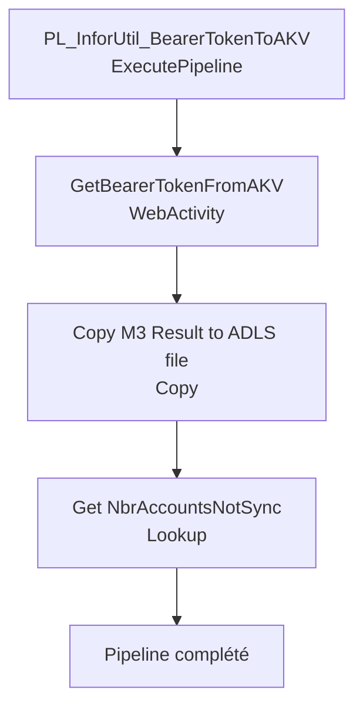

# Analyse du Pipeline Azure Data Factory

## 1. Vue d'ensemble

### 1.1 Nom du pipeline

`PL_IntgrID_Account_ValidateItemsNotSync_M3ToD365`

### 1.2 Objectif

Valider et extraire les comptes clients dans une plage numérique spécifiée depuis Infor M3 via API REST. Ce pipeline génère un bearer token Infor, récupère les données via une requête REST, et sauvegarde les résultats pour validation de synchronisation.

### 1.3 Contexte d'exécution

Validation / Delta Sync : Appel API REST vers M3 avec authentification Bearer Token. Timeout court (1 minute) pour web calls. Lookup sur la base de données pour compter les comptes non-synchronisés.

### 1.4 Cycle de vie des données

Infor M3 (API REST) → Bearer Token (Azure Key Vault) → Requête REST (EXPORTMI SelectPad) → Résultat JSON → ADLS (stockage).

---

## 2. Architecture du pipeline

### 2.1 Flux d'exécution principal



---

## 3. Activités à haut niveau

| # | Nom de l'activité | Type | Rôle |
|---|---|---|---|
| 1 | PL_InforUtil_BearerTokenToAKV | ExecutePipeline | Appelle un pipeline utilitaire pour générer/rafraîchir le bearer token Infor et stocker en Azure Key Vault |
| 2 | GetBearerTokenFromAKV | WebActivity | Récupère le bearer token depuis Azure Key Vault via API REST et authentification MSI |
| 3 | Copy M3 Result to ADLS file | Copy | Requête REST vers API Infor M3 (EXPORTMI) avec authentification Bearer, résultat en JSON vers ADLS |
| 4 | Get NbrAccountsNotSync | Lookup | Requête sur la base de données (MariaDB/Synapse) pour compter les comptes non-synchronisés dans la plage |

---

## 4. Variables

| Variable | Type | Description |
|---|---|---|
| Aucune | - | Ce pipeline n'utilise pas de variables explicites |

---

## 5. Paramètres

| Paramètre | Type | Valeur par défaut | Description |
|---|---|---|---|
| `ForceRenewInforApiBearerToken` | Boolean | false | Si true, force la génération d'un nouveau bearer token |
| `MinAccountNotRange` | String | Non défini | Numéro de compte minimum pour la plage de validation |
| `MaxAccountNotRange` | String | Non défini | Numéro de compte maximum pour la plage de validation |
| `containerName` | String | Non défini | Nom du conteneur ADLS où stocker le résultat |
| `ProcessFilesPath` | String | Non défini | Chemin dans le conteneur ADLS pour le fichier |
| `AdlsFileNameM3Data` | String | Non défini | Nom du fichier pour les données M3 |

---

## 6. Flux de données

| Source | Destination | Technologie | Format |
|---|---|---|---|
| Infor M3 API (EXPORTMI) | ADLS | REST + CopyActivity + AzureBlobFS | JSON |
| MariaDB / Synapse | Lookup Output | Query SQL | JSON (Lookup result) |

---

## 7. Champs mappés

**Requête API Infor M3** :

```
M3/m3api-rest/v2/execute/EXPORTMI/SelectPad
Paramètres :
  SEPC=|           (séparateur pipe)
  HDRS=0           (pas d'en-têtes)
  QERY=count(*) from OCUSMA 
    where OKCONO = {InforCompanyNumber}
    AND OKCUNO > '{MinAccountNotRange}'
    AND OKCUNO < '{MaxAccountNotRange}'
  maxrecs=0        (pas de limite de records)
```

Résultat : JSON avec la structure M3 contenant le compte (count) des enregistrements.

---

## 8. Chemins et emplacements

| Chemin | Type | Description |
|---|---|---|
| `https://sanimarcdev-kv.vault.azure.net/secrets/InforAPI-BearerToken-Value/?api-version=7.0` | Azure Key Vault | Stockage du bearer token sécurisé |
| `@{pipeline().parameters.containerName}` | ADLS2 | Conteneur cible |
| `@{pipeline().parameters.ProcessFilesPath}` | ADLS2 | Répertoire de traitement |
| `@{pipeline().parameters.AdlsFileNameM3Data}` | ADLS2 | Fichier JSON des résultats M3 |
| API Infor REST | REST endpoint | `https://sanimarcdev-kv.vault.azure.net` + M3 API path |

---

## 9. Notes complémentaires

### Points d'attention

- **Bearer Token MSI** : Authentification via Managed Service Identity (MSI) pour sécuriser l'accès Azure Key Vault. Aucune clé stockée dans ADF.
- **Requête EXPORTMI** : Utilise l'API Infor M3 EXPORTMI/SelectPad pour lancer une requête SQL et retourner les résultats en JSON.
- **Plage numérique** : Les paramètres MinAccountNotRange et MaxAccountNotRange permettent de découper le traitement par tranches de comptes.
- **Timeout court** : 1 minute pour les WebActivity (GetBearerTokenFromAKV, Copy M3 Result) - ajuster selon la taille des données et latence réseau.
- **Timeout très court** : Lookup timeout = 1 minute, retry = 0 - pas de retry automatique, à considérer pour robustesse.

### Recommandations ADF - Bonnes pratiques

1. **Sécurité** : Utilisation de MSI et Azure Key Vault pour les secrets - excellente pratique, pas de hardcoding de tokens.
2. **Modularité** : Appel à un pipeline utilitaire (`PL_InforUtil_BearerTokenToAKV`) pour générer les tokens - bon pattern de réutilisabilité.
3. **Optimisations suggérées** :
   - Ajouter une activité Until avec retry pour la WebActivity GetBearerTokenFromAKV en cas d'échec réseau ou timeout.
   - Augmenter le timeout pour Copy et Lookup à 5-10 minutes selon les volumes de données M3.
   - Ajouter une activité WebActivity de notification/alerting en cas d'erreur pour traçabilité opérationnelle.
   - Valider que le cast de la plage numérique est bien formé (éviter les injections SQL via les paramètres).
4. **Paramètres globaux** : Vérifier que `InforCompanyNumber` est défini dans les paramètres globaux du factory.
5. **Dataset DS_REST_InforAPICall** : Vérifier que l'URL est paramétrée correctement avec les plages numériques dans la propriété APIUrl.

