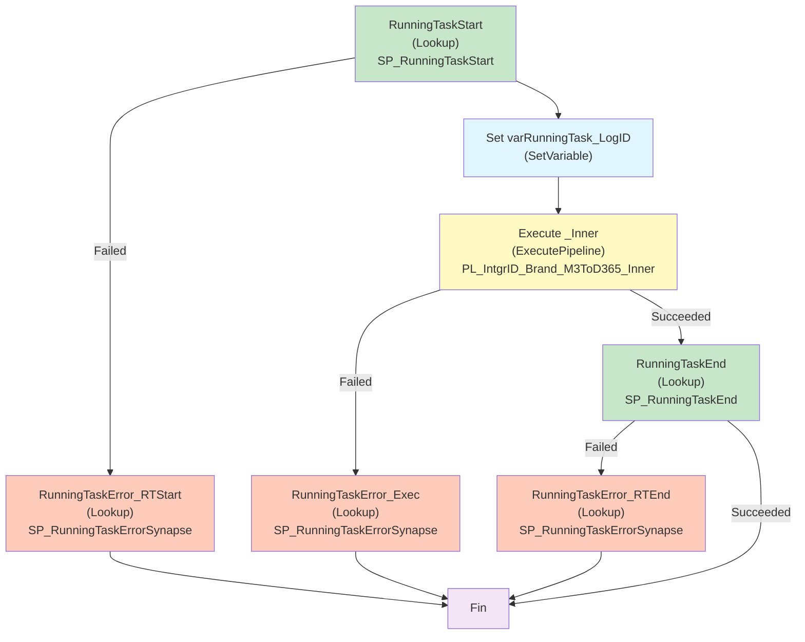

# Analyse du Pipeline Azure Data Factory

## 1. Vue d'ensemble

### 1.1 Nom du pipeline

`PL_IntgrID_Brand_M3ToD365`

### 1.2 Objectif

Pipeline orchestrateur de synchronisation des marques (Brand) depuis Infor M3 vers Dynamics 365. Ce pipeline encapsule le pipeline inner `PL_IntgrID_Brand_M3ToD365_Inner` avec un cadre de gestion d'erreurs robuste et de logging centralisé via MariaDB. Il gère l'initialisation, l'exécution du traitement métier, et la finalization avec enregistrement des résultats en base de données.

### 1.3 Contexte d'exécution

- **Mode** : Synchronisation avec logging et audit via MariaDB
- **Orchestration** : Wrapper autour du pipeline inner pour supervision + gestion d'erreurs
- **Logging** : Logging intégral des débuts, fins et erreurs via procédures stockées MariaDB
- **Portée** : Entité métier Brand, peut être appelé par un orchestrateur d'ordre supérieur

### 1.4 Cycle de vie des données

1. **Initialisation du log** : Appel `SP_RunningTaskStart` pour créer un enregistrement de log au démarrage
2. **Capture du LogID** : Sauvegarde de l'ID du log pour tous les enregistrements ultérieurs
3. **Exécution du pipeline métier** : Appel du pipeline inner `PL_IntgrID_Brand_M3ToD365_Inner` en attente de fin
4. **Finalization du log** : Appel `SP_RunningTaskEnd` pour marquer la fin réussie
5. **Gestion d'erreurs** : En cas de défaillance à n'importe quel stade, enregistrement de l'erreur via `SP_RunningTaskErrorSynapse`

---

## 2. Architecture du pipeline

### 2.1 Flux d'exécution principal



---

## 3. Activités à haut niveau

| # | Nom de l'activité | Type | Rôle |
|---|---|---|---|
| 1 | RunningTaskStart | Lookup | Initialise un enregistrement de log dans MariaDB via `SP_RunningTaskStart`. Retourne un LogID unique. |
| 2 | Set varRunningTask_LogID | SetVariable | Capture l'ID du log retourné pour l'utiliser dans toutes les opérations ultérieures d'erreur et de finalization. |
| 3 | Execute _Inner | ExecutePipeline | Appelle le pipeline inner `PL_IntgrID_Brand_M3ToD365_Inner` en mode synchrone (waitOnCompletion: true) et transmet tous les paramètres. |
| 4 | RunningTaskEnd | Lookup | Marque la fin réussie du pipeline en appelant `SP_RunningTaskEnd` pour clôturer le log. Appelée seulement si `Execute _Inner` réussit. |
| 5 | RunningTaskError_RTStart | Lookup | Handler d'erreur : enregistre l'erreur de démarrage (RunningTaskStart) dans MariaDB via `SP_RunningTaskErrorSynapse`. |
| 6 | RunningTaskError_Exec | Lookup | Handler d'erreur : enregistre l'erreur du pipeline inner via `SP_RunningTaskErrorSynapse`. Ajoute un message de conseil pour consulter Azure Synapse Monitor. |
| 7 | RunningTaskError_RTEnd | Lookup | Handler d'erreur : enregistre l'erreur de finalization (RunningTaskEnd) dans MariaDB via `SP_RunningTaskErrorSynapse`. |

---

## 4. Variables

| Variable | Type | Description |
|---|---|---|
| varRunningTask_LogID | String | Identifiant unique du log dans MariaDB, retourné par `SP_RunningTaskStart`. Utilisé pour tracer tous les enregistrements d'erreur et pour clôturer le log avec `SP_RunningTaskEnd`. |

---

## 5. Paramètres

| Paramètre | Type | Valeur par défaut | Description |
|---|---|---|---|
| sftpPath | string | `SyncInforToAzure/` | Chemin racine sur le serveur SFTP pour la réception des fichiers bruts. Transmis au pipeline inner. |
| ProcessedPath | string | `Archive/` | Chemin relatif sur SFTP pour archiver les fichiers traités avec succès. Transmis au pipeline inner. |
| ErrorPath | string | `Error/` | Chemin relatif sur SFTP pour stocker les fichiers en erreur. Transmis au pipeline inner. |
| EntityName | string | `Brand` | Nom de l'entité métier traitée (Brand). Transmis au pipeline inner. |
| adlsContainerName | string | `integration` | Conteneur Azure Data Lake Storage Gen2 pour les fichiers temporaires. Transmis au pipeline inner. |
| adlsProcessFilesPath | string | `ToD365/Landing/` | Chemin ADLS pour les fichiers temporaires et listes. Transmis au pipeline inner. |

---

## 6. Flux de données

| Source | Type | Destination | Technologie | Rôle |
|---|---|---|---|---|
| Pipeline orchestrateurs | Paramètres | Pipeline `PL_IntgrID_Brand_M3ToD365_Inner` | ExecutePipeline | Transmission des directrices d'exécution (chemins, entité) |
| Base MariaDB | management.SP_RunningTaskStart | Variable varRunningTask_LogID | MariaDB Lookup | Initialisation du log d'exécution |
| Pipeline inner | Sortie de succès/erreur | Activités de gestion d'erreurs | Conditional dépendances | Branchement vers finalization ou gestion d'erreur |
| Base MariaDB | management.SP_RunningTaskEnd | Fin du log | MariaDB Lookup | Clôture du log en cas de succès |
| Base MariaDB | management.SP_RunningTaskErrorSynapse | Enregistrement d'erreur | MariaDB Lookup | Logging centralisé des défaillances |

---

## 7. Champs mappés

Le pipeline principal est un orchestrateur qui ne transforme pas les données ; il transmet les paramètres au pipeline inner :

- **Paramètres transmis au pipeline inner** :
  - `sftpPath`, `ProcessedPath`, `ErrorPath`, `EntityName`, `adlsContainerName`, `adlsProcessFilesPath`
  - `RunningTask_LogID` (généré dynamiquement) : ID unique du log pour traçabilité
  - `RunningTask_TaskName` : Nom du pipeline pour le logging

- **Conventions de logging MariaDB** :
  - **SP_RunningTaskStart** : Prend le nom du pipeline et retourne un LogID
  - **SP_RunningTaskEnd** : Clôture le log avec le LogID
  - **SP_RunningTaskErrorSynapse** : Enregistre les erreurs avec la sévérité (1 = erreur), les détails et le RunId du pipeline

---

## 8. Chemins et emplacements

| Chemin logique | Chemin réel | Type | Rôle | Remarques |
|---|---|---|---|---|
| Base de données de log | MariaDB (management schema) | Mariadb | Logging centralisé | Contient les procédures SP_RunningTaskStart, SP_RunningTaskEnd, SP_RunningTaskErrorSynapse |
| SFTP Landing | `{sftpPath}{EntityName}/` (ex: `SyncInforToAzure/Brand/`) | SFTP | Source des fichiers à traiter | Transmis au pipeline inner |
| SFTP Archive | `{sftpPath}{ProcessedPath}{EntityName}/` | SFTP | Archivage des fichiers réussis | Transmis au pipeline inner |
| SFTP Error | `{sftpPath}{ErrorPath}{EntityName}/` | SFTP | Stockage des fichiers en erreur | Transmis au pipeline inner |
| ADLS Container | `integration` | ADLS Gen2 | Stockage des fichiers temporaires | Transmis au pipeline inner |

---

## 9. Notes complémentaires

### 9.1 Points d'attention

- **Logging obligatoire** : Le pipeline débute toujours par un appel `SP_RunningTaskStart`. Si cet appel échoue, une activité dédiée `RunningTaskError_RTStart` enregistre l'erreur, mais le pipeline ne se poursuit pas (pas d'exécution du pipeline inner).
- **Transmission de LogID** : Le LogID généré au démarrage est transmis au pipeline inner via le paramètre `RunningTask_LogID`. Cela permet au pipeline inner remonter les erreurs granulaires (par fichier, par DataFlow) dans le même contexte de log.
- **WaitOnCompletion** : L'activité ExecutePipeline utilise `waitOnCompletion: true`, ce qui signifie que le pipeline principal attend la fin complète du pipeline inner avant de passer à RunningTaskEnd ou de gérer l'erreur.
- **Gestion d'erreurs exhaustive** : Trois points de défaillance potentielle sont protégés :
  1. Démarrage du log (RunningTaskError_RTStart)
  2. Exécution du pipeline inner (RunningTaskError_Exec)
  3. Finalization du log (RunningTaskError_RTEnd)

### 9.2 Dépendances externes

- **Pipeline inner** : `PL_IntgrID_Brand_M3ToD365_Inner` (doit exister et être deployée)
- **Base MariaDB** : 
  - Procédure `management.SP_RunningTaskStart`
  - Procédure `management.SP_RunningTaskEnd`
  - Procédure `management.SP_RunningTaskErrorSynapse`
- **Linked Service MariaDB** : `DS_MariaDB` (doit être configuré avec les bonnes credentials)

### 9.3 Recommandations d'amélioration

1. **Retry sur démarrage du log** : Ajouter `policy.retry: 1` sur `RunningTaskStart` pour gérer les défaillances réseau transitoires vers MariaDB.
2. **Timeout ajusté** : Actuellement, tous les Lookup ont un timeout de 30 secondes. Évaluer si c'est suffisant pour les appels MariaDB en charge.
3. **Monitoring des LogID** : Créer un dashboard pour surveiller les LogID générés et identifier les patterns d'erreur.
4. **Orchestration multi-entités** : Ce pipeline gère uniquement Brand. Envisager un pipeline parent qui orchestrerait Brand + Accounts + Items pour une synchronisation globale.
5. **Alerting** : Intégrer des alertes sur la procédure `SP_RunningTaskErrorSynapse` pour notification immédiate en cas d'erreur.
6. **Auditing avancé** : Enregistrer aussi la durée d'exécution du pipeline inner pour identifier les goulots d'étranglement.

### 9.4 Flux des erreurs

```
┌─────────────────────────────────────────────────────────────┐
│ Premier appel : RunningTaskStart (Lookup)                  │
│ ├─ Succès → Capture LogID → Execute _Inner                 │
│ └─ Erreur → RunningTaskError_RTStart → FIN                 │
├─────────────────────────────────────────────────────────────┤
│ Exécution : Execute _Inner (ExecutePipeline)               │
│ ├─ Succès → RunningTaskEnd                                 │
│ └─ Erreur → RunningTaskError_Exec (+ message diagnos.) → FIN │
├─────────────────────────────────────────────────────────────┤
│ Finalization : RunningTaskEnd (Lookup)                      │
│ ├─ Succès → FIN (OK)                                        │
│ └─ Erreur → RunningTaskError_RTEnd → FIN                   │
└─────────────────────────────────────────────────────────────┘
```

### 9.5 Appels MariaDB détaillés

#### 9.5.1 SP_RunningTaskStart
```sql
CALL management.SP_RunningTaskStart('<PipelineName>', '0')
```
**Sorties** : 
- `LogID` : Identifiant unique de la session de log

#### 9.5.2 SP_RunningTaskEnd
```sql
CALL management.SP_RunningTaskEnd('<PipelineName>', '<LogID>')
```
**Rôle** : Marque le log comme complété avec succès

#### 9.5.3 SP_RunningTaskErrorSynapse
```sql
CALL management.SP_RunningTaskErrorSynapse(
    '<PipelineName>', 
    <LogID>,
    <Severity>,
    'Error Data: <ErrorDetails>
Pipeline Run ID: <RunId>'
)
```
**Paramètres** :
- `PipelineName` : Identifiant pour audit
- `LogID` : ID du log associé (0 si pas de log créé)
- `Severity` : 1 = erreur
- `Message` : Description détaillée de l'erreur + RunId du pipeline

---

## 10. Interactions avec le pipeline inner

Le pipeline principal communique avec le pipeline inner via :

1. **Paramètres** : Tous les paramètres du principal sont transmis au inner pour assurer la cohérence de l'exécution
2. **Variable LogID** : Le LogID généré localement est transmis au pipeline inner pour que ce dernier puisse enregistrer ses erreurs granulaires dans le même contexte
3. **WaitOnCompletion** : Le principal attend que le inner se termine avant d'agent vers la finalization

**Arborescence d'invocation** :
```
PL_IntgrID_Brand_M3ToD365 (Parent)
└── PL_IntgrID_Brand_M3ToD365_Inner (Enfant)
    ├── DF_SFTP_OrderedFilesList
    ├── DF_D365_Brand (dans ForEach, multiple fois)
    └── (Gestion des fichiers SFTP et MariaDB)
```

---

## 11. Schéma de versions

| Date | Version | Modification |
|---|---|---|
| 2024-08-12 | 1.0 | Pipeline publié en production |

