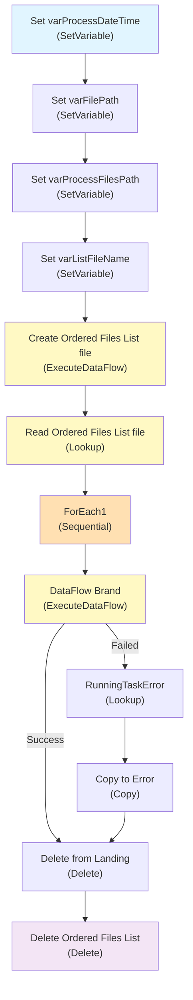

# PL_IntgrID_Brand_M3ToD365_Inner

## 1. Vue d'ensemble

### 1.1 Nom du pipeline

`PL_IntgrID_Brand_M3ToD365_Inner`

### 1.2 Objectif

Pipeline interne de synchronisation des éléments de marque depuis Infor M3 vers Dynamics 365. Traite les fichiers JSON reçus via SFTP, crée une liste ordonnée des fichiers, exécute la transformation DataFlow Brand, et gère l'archivage ou le déplacement vers dossier d'erreur selon les résultats du traitement.

### 1.3 Contexte d'exécution

- **Mode**: Synchronisation incrémentale avec support de multiples fichiers en séquence
- **Source**: Fichiers JSON sur serveur SFTP sous répertoire `Brand/`
- **Destinations**: Azure Data Lake Storage Gen2 (ADLS) + Serveur SFTP (Archive/Error)
- **Gestion d'erreurs**: Logging en MariaDB, déplacement des fichiers en erreur, nettoyage des fichiers traitées

### 1.4 Cycle de vie des données

1. **Initialisation** : Génération d'horodatage et construction des chemins de travail
2. **Découverte** : Création d'une liste ordonnée des fichiers à traiter stockée en ADLS
3. **Lecture** : Récupération de la liste JSON depuis ADLS via `Lookup`
4. **Traitement** : Boucle séquentielle sur chaque fichier :
   - Exécution du DataFlow `DF_D365_Brand` pour transformation
   - En cas d'erreur : copie du fichier vers dossier Error et logging de l'erreur
   - En cas de succès : suppression du fichier de la zone Landing
5. **Nettoyage** : Suppression du fichier liste des fichiers ordonnés depuis ADLS

---

## 2. Architecture du pipeline

### 2.1 Flux d'exécution principal

---

## 3. Activités à haut niveau

| # | Nom de l'activité | Type | Rôle |
|---|---|---|---|
| 1 | Set varProcessDateTime | SetVariable | Initialise l'horodatage du traitement au format `yyyyMMddTHHmmss` (Eastern Standard Time) |
| 2 | Set varFilePath | SetVariable | Construit le chemin SFTP des fichiers à traiter : `sftpPath + EntityName + /` |
| 3 | Set varProcessFilesPath | SetVariable | Construit le chemin ADLS pour les fichiers de traitement : `adlsProcessFilesPath + EntityName + /` |
| 4 | Set varListFileName | SetVariable | Génère le nom du fichier liste : `EntityName + ProcessDateTime + .json` |
| 5 | Create Ordered Files List file | ExecuteDataFlow | Exécute le DataFlow `DF_SFTP_OrderedFilesList` pour découvrir et lister les fichiers SFTP disponibles |
| 6 | Read Ordered Files List file | Lookup | Lit le fichier liste JSON généré depuis ADLS et extrait la collection de fichiers à traiter |
| 7 | ForEach1 | ForEach | Boucle séquentielle sur chaque fichier de la liste pour traitement individuel |
| 8 | DataFlow Brand | ExecuteDataFlow (dans forEach) | Exécute le DataFlow `DF_D365_Brand` pour transformer et synchroniser les données Brand |
| 9 | RunningTaskError_DFBrand | Lookup (dans forEach) | Enregistre les erreurs du DataFlow dans la base MariaDB et appelle la procédure stockée d'erreur |
| 10 | Copy file to Error folder | Copy (dans forEach) | Déplace le fichier en erreur vers le dossier `ErrorPath/EntityName/YYYYMM/` en suffixant avec le RunId |
| 11 | Remove file from Landing folder | Delete (dans forEach) | Supprime le fichier traité (succès ou erreur) de la zone Landing SFTP |
| 12 | Delete Ordered Files List file | Delete | Nettoyage final : supprime le fichier liste depuis ADLS après traitement de tous les fichiers |

---

## 4. Variables

| Variable | Type | Description |
|---|---|---|
| varProcessDateTime | String | Horodatage du traitement au format `yyyyMMddTHHmmss` (Eastern Standard Time). Utilisé pour créer des noms de fichiers et répertoires datés. |
| varFilePath | String | Chemin SFTP des fichiers à traiter, construit dynamiquement : `{sftpPath}{EntityName}/` (ex: `SyncInforToAzure/Brand/`) |
| varProcessFilesPath | String | Chemin ADLS pour les fichiers temporaires de traitement : `{adlsProcessFilesPath}{EntityName}/` (ex: `ToD365/Landing/Brand/`) |
| varListFileName | String | Nom du fichier liste des fichiers ordonnés, combinant l'entité et l'horodatage : `{EntityName}{ProcessDateTime}.json` (ex: `Brand20240812T143648.json`) |

---

## 5. Paramètres

| Paramètre | Type | Valeur par défaut | Description |
|---|---|---|---|
| sftpPath | string | `SyncInforToAzure/` | Chemin racine sur le serveur SFTP pour la réception des fichiers bruts |
| ProcessedPath | string | `Archive/` | Chemin relatif sur SFTP pour archiver les fichiers traités avec succès |
| ErrorPath | string | `Error/` | Chemin relatif sur SFTP pour stocker les fichiers en erreur avec le RunId du pipeline |
| EntityName | string | `Brand` | Nom de l'entité métier traitée (utilisé pour les noms de fichiers et répertoires) |
| adlsContainerName | string | `integration` | Conteneur Azure Data Lake Storage Gen2 utilisé pour les fichiers temporaires et les listes |
| adlsProcessFilesPath | string | `ToD365/Landing/` | Chemin ADLS pour stocker les fichiers temporaires et les listes ordonnées |
| RunningTask_LogID | string | `0` | Identifiant du log héritée du pipeline parent, utilisé pour les enregistrements d'erreur dans MariaDB |
| RunningTask_TaskName | string | `PL_IntgrID_Brand_M3ToD365` | Nom de la tâche pour le logging en MariaDB (héritée du pipeline parent) |

---

## 6. Flux de données

| Source | Type | Destination | Technologie | Rôle |
|---|---|---|---|---|
| Serveur SFTP | Fichiers JSON | DataFlow `DF_SFTP_OrderedFilesList` | SFTP ReadSettings | Découverte des fichiers de marque disponibles |
| ADLS Gen2 | Fichier liste (JSON) | DataFlow `DF_D365_Brand` | AzureBlobFS ReadSettings | Source de la liste ordonnée des fichiers à traiter |
| Serveur SFTP (Landing) | Fichiers JSON | DataFlow `DF_D365_Brand` | SFTP ReadSettings | Source des données à synchroniser |
| DataFlow Transformation | Données transformées | Multiples destinations | Databricks Spark Cluster (8 cores) | Traitement, validation et synchronisation des Brand vers D365 |
| Serveur SFTP | Fichiers en erreur | Dossier Error | SFTP WriteSettings | Archivage des fichiers ayant échoué le traitement |
| Base MariaDB | management.SP_RunningTaskErrorSynapse | Logging | MariaDB (Lookup) | Enregistrement centralisé des erreurs |

---

## 7. Champs mappés

Le pipeline utilise un modèle de traitement basé sur fichiers JSON. Le DataFlow `DF_D365_Brand` assure la transformation des champs Brand de M3 vers D365 :

- **Source (M3 via SFTP)** : Fichiers JSON contenant des enregistrements Brand avec attributs métier
- **Transformation** : Le DataFlow effectue les mappages, validations et transformations pour conformité D365
- **Action (Sync Type)** : Chaque enregistrement contient un champ `Action` définissant le type de synchronisation (Create, Update, Delete)
- **Destination (D365)** : Les données transformées sont envoyées vers Dynamics 365

**Paramètres du DataFlow** :
- `df_SyncType` : Type de synchronisation extrait du champ `Action` de chaque fichier
- `df_FilePath` : Chemin SFTP source des fichiers à traiter
- `df_ProcessedPath` : Chemin SFTP de destination pour les fichiers archivés

---

## 8. Chemins et emplacements

| Chemin logique | Chemin réel | Type | Rôle | Remarques |
|---|---|---|---|---|
| SFTP Landing | `{sftpPath}{EntityName}/` (ex: `SyncInforToAzure/Brand/`) | SFTP | Zone de réception des fichiers bruts en JSON | Source primaire des données |
| SFTP Archive | `{sftpPath}{ProcessedPath}{EntityName}/YYYYMM/` | SFTP | Archivage des fichiers traités avec succès | Organisé par mois (YYYYMM) |
| SFTP Error | `{sftpPath}{ErrorPath}{EntityName}/YYYYMM/` | SFTP | Stockage des fichiers en erreur suffixés avec Ru RunId | Permet la traçabilité des erreurs |
| ADLS Temp/Liste | `{adlsProcessFilesPath}{EntityName}/{ListFileName}` | ADLS Gen2 | Fichier liste ordonnée des fichiers à traiter | Créé par DF_SFTP_OrderedFilesList, supprimé après traitement |
| ADLS Container | `integration` | ADLS Gen2 | Conteneur principal de l'intégration | Stockage centralisé pour toutes les données d'intégration |

---

## 9. Notes complémentaires

### 9.1 Points d'attention

- **Exécution séquentielle** : Le ForEach est configuré en mode séquentiel (`isSequential: true`), chaque fichier est traité l'un après l'autre. Cela garantit l'ordre de traitement mais peut impacter les performances pour de nombreux fichiers.
- **Gestion d'erreurs granulaire** : Chaque activité DataFlow échoue silencieusement et une activité Lookup est exécutée pour logger l'erreur et déplacer le fichier. Le pipeline continue malgré les erreurs individuelles.
- **Timeout des DataFlows** : `DF_SFTP_OrderedFilesList` a un timeout de 3 heures (`0.03:00:00`), `DF_D365_Brand` a un timeout d'1 heure (`0.01:00:00`).
- **Compute Databricks** : Les DataFlows utilisent un cluster Databricks avec 8 cores, compute type "General", et traceLevel "Fine" pour un suivi détaillé.
- **Nettoyage** : Le fichier liste est systématiquement supprimé après traitement pour éviter l'accumulation dans ADLS.

### 9.2 Dépendances externes

- **DataFlows** : `DF_SFTP_OrderedFilesList`, `DF_D365_Brand` (doivent exister dans l'usine ADF)
- **Datasets** : `DS_SFTP_Filename`, `DS_ADLS_Filename`, `DS_MariaDB` (doivent être configurés avec les bons paramètres)
- **Linked Services** : SFTP, Azure Data Lake Storage Gen2, MariaDB
- **Cluster Databricks** : Configuration en amont requise pour les DataFlows

### 9.3 Recommandations d'amélioration

1. **Parallélisation** : Envisager le mode `isSequential: false` si l'ordre d'exécution n'est pas critique. Cela amplifierait le débit de traitement.
2. **Partition du traitement** : Si le nombre de fichiers est très élevé, diviser le traitement en lots (ex: par date) pour meilleure gestion mémoire.
3. **Monitoring** : Ajouter des métriques de traitement (nombre de fichiers, tailles, durées) pour une meilleure observabilité.
4. **Validation des données** : Intégrer une étape de validation des fichiers avant le DataFlow pour détecter les malformés en amont.
5. **Retry policy** : Actuellement `retry: 0` pour toutes les activités. Évaluer l'ajout de retry pour les activités de lecture (Lookup, Copy) afin de gérer les défaillances réseau transitoires.

### 9.4 Flux d'erreur et logging

Lorsqu'une activité DataFlow échoue :
1. L'activité `RunningTaskError_DFBrand` (type Lookup) est déclenchée
2. Elle appelle la procédure stockée MariaDB : `management.SP_RunningTaskErrorSynapse` avec :
   - Le nom de la tâche (`RunningTask_TaskName`)
   - L'ID du log (`RunningTask_LogID`)
   - Severity `1` (erreur)
   - Détails de l'erreur et l'ID du pipeline run
3. Ensuite, le fichier est copié vers le dossier Error (suffixé avec le RunId) et supprimé de la zone Landing

### 9.5 Paramètres dynamiques et expressions

Le pipeline utilise massivement les expressions ADF :
- `convertFromUtc()` pour l'horodatage timezone-aware
- `concat()` pour la construction dynamique des chemins
- `substring()` pour extraire le mois de l'horodatage
- `replace()` pour modifier les noms de fichiers en erreur
- `pipeline().RunId`, `pipeline().parameters`, `variables()` pour accéder aux contextes d'exécution

---

## 10. Schéma de versions

| Date | Version | Modification |
|---|---|---|
| 2024-08-12 | 1.0 | Pipeline publié en production |

