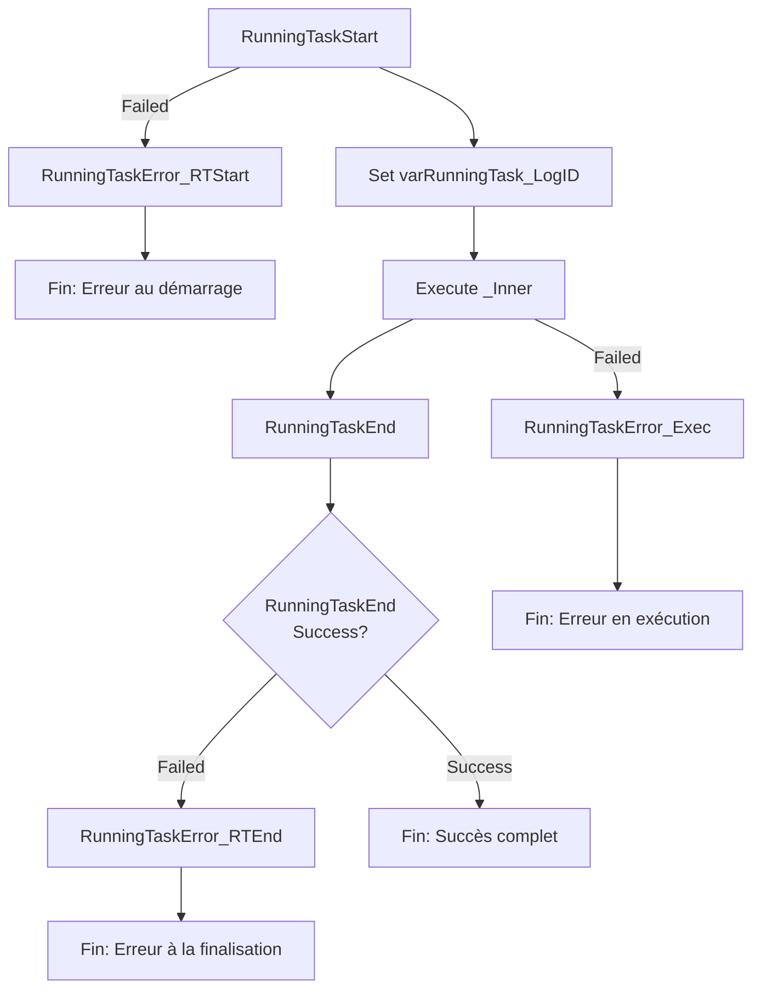

# PL_IntgrID_CustomerAsset_M3ToD365

## 1. Vue d'ensemble

### 1.1 Nom du pipeline

`PL_IntgrID_CustomerAsset_M3ToD365`

### 1.2 Objectif

Pipeline principal orchestrant la synchronisation complète des actifs clients (CustomerAsset) entre Infor M3 et Microsoft Dynamics 365. Ce pipeline gère l'ensemble du cycle de vie du traitement : initialisation du log de la tâche, exécution du pipeline interne de traitement, finalisation du log, et gestion centralisée des erreurs.

### 1.3 Contexte d'exécution

- **Mode de traitement** : Full Load et Synchronisation incrémentale (Delta)
- **Fréquence** : Configuration flexible via paramètres, déclenché par un trigger ou une orchestration supérieure
- **Type d'exécution** : Orchestration de pipeline via ExecutePipeline

### 1.4 Cycle de vie des données

1. **Initialisation** : Logging du démarrage de la tâche dans MariaDB via `SP_RunningTaskStart`
2. **Extraction de l'ID de log** : Récupération et stockage du LogID pour traçabilité
3. **Exécution du traitement interne** : Appel du pipeline `PL_IntgrID_CustomerAsset_M3ToD365_Inner` avec tous les paramètres
4. **Finalisation** : Logging de la fin de la tâche dans MariaDB via `SP_RunningTaskEnd`
5. **Gestion des erreurs** : Capture et logging de toute défaillance à chaque étape (démarrage, exécution, finalisation)
6. **Traçabilité complète** : Tous les logs incluent le RunID du pipeline pour audit et débogage

---

## 2. Architecture du pipeline

### 2.1 Flux d'exécution principal

---

## 3. Activités à haut niveau

| # | Nom de l'activité | Type | Rôle |
|---|---|---|---|
| 1 | RunningTaskStart | Lookup | Initialise une nouvelle tâche de traitement dans MariaDB et retourne un LogID unique |
| 2 | Set varRunningTask_LogID | SetVariable | Extrait et stocke l'ID de log depuis la réponse de RunningTaskStart, utilisé pour traçabilité |
| 3 | RunningTaskEnd | Lookup | Finalise la tâche dans MariaDB avec succès, marquant la fin normale du traitement |
| 4 | RunningTaskError_RTStart | Lookup | En cas d'erreur lors du démarrage, appelle `SP_RunningTaskErrorSynapse` pour logger l'anomalie |
| 5 | RunningTaskError_Exec | Lookup | En cas d'erreur lors de l'exécution du pipeline Inner, log l'anomalie avec détails du Run ID |
| 6 | RunningTaskError_RTEnd | Lookup | En cas d'erreur lors de la finalisation, log l'anomalie avec instruction d'audit |
| 7 | Execute _Inner | ExecutePipeline | Appel au pipeline interne `PL_IntgrID_CustomerAsset_M3ToD365_Inner` avec propagation de tous les paramètres, attente de la complétion |

---

## 4. Variables

| Variable | Type | Description |
|---|---|---|
| `varProcessDateTime` | String | Horodatage du traitement au format `yyyyMMddTHHmmss`. Générée et initialisée dans le pipeline Inner (non utilisée directement dans le pipeline parent) |
| `varFilePath` | String | Chemin SFTP pour l'accès aux fichiers. Construit dans le pipeline Inner (passé via paramètres) |
| `varProcessedFilesPath` | String | Chemin ADLS pour les fichiers de traitement. Construit dans le pipeline Inner |
| `varListFileName` | String | Nom du fichier d'inventaire. Construit dans le pipeline Inner |
| `varRunningTask_LogID` | String | ID unique du log de la tâche actuelle, extraite de `RunningTaskStart` et utilisée pour tous les appels de log/erreur |
| `varErrorMsg` | String | Variable de message d'erreur (définie mais peu utilisée dans le JSON actuel) |
| `varSPCall` | String | Variable réservée pour les appels de procédure stockée (définie mais peu utilisée) |
| `varWarningManualUpdateFileName` | String | Variable réservée pour les fichiers de mise à jour manuelle (définie mais peu utilisée) |

---

## 5. Paramètres

| Paramètre | Type | Valeur par défaut | Description |
|---|---|---|---|
| `sftpPath` | String | `SyncInforToAzure/` | Répertoire racine sur le serveur SFTP pour les fichiers d'entrée M3 |
| `ProcessedPath` | String | `Archive/` | Sous-répertoire SFTP pour archiver les fichiers traités avec succès |
| `ErrorPath` | String | `Error/` | Sous-répertoire SFTP pour isoler les fichiers en erreur |
| `EntityName` | String | `CustomerAsset` | Nom de l'entité métier synchronisée (détermine les chemins et les DataFlows appliqués) |
| `adlsContainerName` | String | `integration` | Conteneur Azure Data Lake Storage pour les fichiers d'inventaire, d'avertissement et de traitement |
| `adlsProcessFilesPath` | String | `ToD365/Landing/` | Chemin ADLS pour le stockage des fichiers intermédiaires et des inventaires |

**Flux des paramètres :** Tous les paramètres du pipeline parent sont transmis au pipeline Inner via la section `parameters` de l'activité `Execute _Inner`.

---

## 6. Flux de données

| Source | Destination | Type de transfert | Technologie | Volume estimation |
|---|---|---|---|---|
| MariaDB | Pipeline Parent | Initialisation et finalisation | Lookup avec Stored Procedures | 2 requêtes par exécution |
| Pipeline Parent | Pipeline Inner | Cascadage complet des paramètres | ExecutePipeline | Tous les paramètres métier |
| M3 Files (SFTP) | D365-Ready Data (ADLS) | Transformation complète | Pipeline Inner + DataFlows | Dépendant du volume d'actifs M3 |
| MariaDB | Error Handling | Logging des défaillances | Lookup avec LogID | 1 enregistrement par erreur |

---

## 7. Champs mappés

Le pipeline parent ne traite pas directement les données métier ; il orchestr la transformation effectuée par le pipeline Inner. Cependant, voici les informations de traçabilité mappées :

**Métadonnées de traçabilité :**
- `LogID` : Identifiant unique d'exécution
- `Pipeline` : Nom de la tâche (`pipeline().Pipeline`)
- `RunId` : ID d'exécution Azure Data Factory (pour audit)
- `ErrorData` : Détails de l'erreur en cas de défaillance
- `ErrorCode` : Code d'erreur (défini via l'attribut `1` ou `0` dans les appels procédure)

---

## 8. Chemins et emplacements

| Chemin | Lieu | Fonction | Construction |
|---|---|---|---|
| **Root SFTP** | SFTP | Répertoire racine pour tous les fichiers | `{sftpPath}` (par défaut: `SyncInforToAzure/`) |
| **Landing** | SFTP | Accueil des fichiers M3 bruts | `{sftpPath}{EntityName}/` |
| **Archive (Processed)** | SFTP | Conservation des fichiers traités avec succès | `{sftpPath}{ProcessedPath}{EntityName}/{YYYYMM}/` |
| **Error Folder** | SFTP | Isolation des fichiers avec anomalies | `{sftpPath}{ErrorPath}{EntityName}/{YYYYMM}/` |
| **ADLS Processing** | ADLS | Stockage des fichiers intermédiaires (inventaire, avertissements) | `{adlsContainerName}/{adlsProcessFilesPath}{EntityName}/` |
| **MariaDB Logging** | MariaDB | Base de données de gestion du cycle de vie | Schéma: `management` |

---

## 9. Notes complémentaires

### Points clés de fonctionnement

1. **Orchestration à deux niveaux** :
   - **Niveau 1 (parent)** : Gestion du cycle de vie et logging
   - **Niveau 2 (inner)** : Traitement métier complet avec gestion détaillée des erreurs

2. **Traçabilité complète** :
   - Chaque exécution génère un `LogID` unique via `SP_RunningTaskStart`
   - Tous les logs incluent le `RunId` (identifiant Azure Data Factory) pour audit en bout de chaîne
   - Les erreurs à chaque étape sont tracées via `SP_RunningTaskErrorSynapse`

3. **Résilience** :
   - Le pipeline parent continue même en cas d'erreur dans l'Inner (via `waitOnCompletion: true`)
   - Les erreurs de finalisation sont capturées et loggées indépendamment

### Recommandations d'amélioration

1. **Gestion de publication d'événements** :
   - Ajouter une activité Web pour notifier un système d'événements (Event Hubs) en cas de succès/erreur
   - Permettre aux systèmes en aval (alerting, reporting) de réagir en temps réel

2. **Optimisation des Lookups MariaDB** :
   - Réduire les timeouts (actuellement 30 sec) si les procédures sont plus rapides
   - Ajouter une logique de retry avec délai exponentiel

3. **Variables inutilisées** :
   - Clarifier l'usage de `varErrorMsg` et `varSPCall` ou les supprimer
   - Documenter l'intention de `varWarningManualUpdateFileName`

4. **Monitoring avancé** :
   - Implémenter Application Insights pour tracer les appels ExecutePipeline
   - Créer des alertes sur la durée anormale du pipeline Inner

### Dépendances critiques

- **Pipeline Inner** : `PL_IntgrID_CustomerAsset_M3ToD365_Inner` (requis, doit être présent dans la même fabrique)
- **Linked Service MariaDB** : Doit supporter les procédures stockées :
  - `management.SP_RunningTaskStart(TaskName, InitialStatus)`
  - `management.SP_RunningTaskEnd(TaskName, LogID)`
  - `management.SP_RunningTaskErrorSynapse(TaskName, LogID, ErrorCode, ErrorMessage)`
- **Paramètres par défaut** : Les configurations par défaut des paramètres doivent correspondre au layout SFTP et ADLS du projet

### Configuration des ressources

- **Compute** : Aucune ressource de compute dédiée au pipeline parent (activités légers : Lookup, SetVariable, ExecutePipeline)
- **Timeouts** : Timeout par défaut 30 secondes pour les Lookups (vérifier que les procédures MariaDB se terminent en temps voulu)
- **Logs de rétention** : MariaDB conserve historiquement tous les logs (vérifier la politique de rétention et d'archivage)

