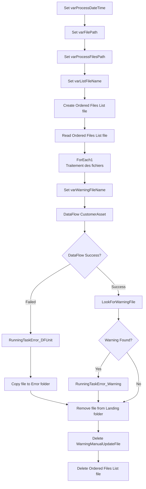

# PL_IntgrID_CustomerAsset_M3ToD365_Inner

## 1. Vue d'ensemble

### 1.1 Nom du pipeline

`PL_IntgrID_CustomerAsset_M3ToD365_Inner`

### 1.2 Objectif

Pipeline interne qui traite les actifs clients (CustomerAsset) depuis le système de gestion M3 vers Dynamics 365. Ce pipeline gère l'extraction, la transformation et le chargement des données d'actifs clients depuis des fichiers SFTP, avec archivage des fichiers traités et gestion des anomalies.

### 1.3 Contexte d'exécution

- **Mode de traitement** : Synchronisation incrémentale (Delta) avec gestion des fichiers en lot
- **Fréquence** : Déclenché par le pipeline principal (`PL_IntgrID_CustomerAsset_M3ToD365`)
- **Type d'exécution** : Traitement séquentiel des fichiers en boucle ForEach

### 1.4 Cycle de vie des données

1. **Ingestion** : Récupération des fichiers JSON depuis le répertoire de landing SFTP (`SyncInforToAzure/CustomerAsset/`)
2. **Inventaire** : Création d'une liste ordonnée des fichiers via DataFlow et ADLS
3. **Traitement** : Exécution d'une boucle ForEach sur chaque fichier avec :
   - Transformation via DataFlow D365
   - Génération de fichiers d'avertissement si nécessaires
   - Déplacement des fichiers traités vers l'archive
   - Gestion des erreurs
4. **Traçabilité** : Logging des erreurs et avertissements via MariaDB
5. **Archivage** : Conservation des fichiers traités dans un répertoire mensuel (`Archive/CustomerAsset/YYYYMM/`)

---

## 2. Architecture du pipeline

### 2.1 Flux d'exécution principal

---

## 3. Activités à haut niveau

| # | Nom de l'activité | Type | Rôle |
|---|---|---|---|
| 1 | Set varProcessDateTime | SetVariable | Initialise l'horodatage du processus (format: yyyyMMddTHHmmss, fuseau: EST) |
| 2 | Set varFilePath | SetVariable | Construit le chemin SFTP cible basé sur EntityName |
| 3 | Set varProcessFilesPath | SetVariable | Construit le chemin ADLS pour les fichiers de traitement |
| 4 | Set varListFileName | SetVariable | Génère le nom du fichier d'inventaire JSON (EntityName_Timestamp.json) |
| 5 | Create Ordered Files List file | ExecuteDataFlow | Exécute le DataFlow `DF_SFTP_OrderedFilesList` pour créer la liste des fichiers ordonnée |
| 6 | Read Ordered Files List file | Lookup | Récupère le contenu du fichier d'inventaire depuis ADLS |
| 7 | ForEach1 | ForEach (0..n itérations) | Boucle séquentielle sur chaque fichier de la liste |
| 7.1 | Set varWarningFileName | SetVariable | Génère le nom du fichier d'avertissement (EntityName_Warning_Timestamp.json) - au sein de ForEach |
| 7.2 | DataFlow CustomerAsset | ExecuteDataFlow | Exécute `DF_D365_CustomerAsset` pour transformer les données |
| 7.3 | RunningTaskError_DFUnit | Lookup | En cas d'erreur du DataFlow, appelle la procédure stockée MariaDB pour signaler l'erreur |
| 7.4 | LookForWarningFile | Lookup | Vérifie la présence de fichiers d'avertissement après le DataFlow |
| 7.5 | If Warning | IfCondition | Branche logique pour traiter les avertissements détectés |
| 7.6 | RunningTaskError_Warning | Lookup | Appelle la procédure stockée MariaDB pour signaler les avertissements |
| 7.7 | Copy file to Error folder | Copy | Déplace le fichier en erreur dans le répertoire d'erreur SFTP |
| 7.8 | Remove file from Landing folder | Delete | Supprime le fichier du landing après traitement (succès ou erreur) |
| 7.9 | Delete WarningManualUpdateFile | Delete | Supprime le fichier d'avertissement après traitement |
| 8 | Delete Ordered Files List file | Delete | Supprime le fichier d'inventaire après traitement complet |

---

## 4. Variables

| Variable | Type | Description |
|---|---|---|
| `varProcessDateTime` | String | Horodatage du processus au format `yyyyMMddTHHmmss` en fuseau EST. Générée par `convertFromUtc(utcnow(),'Eastern Standard Time','yyyyMMddTHHmmss')` |
| `varFilePath` | String | Chemin SFTP de landing pour les fichiers d'actifs clients. Format: `sftpPath + EntityName + '/'` |
| `varProcessFilesPath` | String | Chemin ADLS pour le stockage des fichiers de traitement. Format: `adlsProcessFilesPath + EntityName + '/'` |
| `varListFileName` | String | Nom du fichier d'inventaire contenant la liste des fichiers à traiter. Format: `EntityName + varProcessDateTime + '.json'` |
| `varWarningFileName` | String | Nom du fichier d'avertissement généré par le DataFlow (contexte ForEach). Format: `EntityName + '_Warning_' + varProcessDateTime + '.json'` |
| `varRunningTask_LogID` | String | ID du log de la tâche en cours (hérité du pipeline parent via paramètre) |

---

## 5. Paramètres

| Paramètre | Type | Valeur par défaut | Description |
|---|---|---|---|
| `sftpPath` | String | `SyncInforToAzure/` | Répertoire racine sur le serveur SFTP pour les fichiers d'entrée |
| `ProcessedPath` | String | `Archive/` | Sous-répertoire SFTP pour archiver les fichiers traités |
| `ErrorPath` | String | `Error/` | Sous-répertoire SFTP pour les fichiers en erreur |
| `EntityName` | String | `CustomerAsset` | Nom de l'entité métier traitée (ex: CustomerAsset). Utilisé pour construire les chemins et noms de fichiers |
| `adlsContainerName` | String | `integration` | Conteneur Azure Data Lake Storage pour les fichiers d'inventaire et d'avertissement |
| `adlsProcessFilesPath` | String | `ToD365/Landing/` | Chemin ADLS pour stocker les fichiers de traitement (inventaire, avertissements) |
| `RunningTask_LogID` | String | `0` | ID du log de la tâche parent (fourni par le pipeline principal) |
| `RunningTask_TaskName` | String | `PL_IntgrID_CustomerAsset_M3ToD365` | Nom de la tâche de logging (pour identification dans les appels procédure stockée) |

---

## 6. Flux de données

| Source | Destination | Type de transfert | Technologie | Volume estimation |
|---|---|---|---|---|
| SFTP (Landing) | ADLS (Processing) | Lectures ordonnées des fichiers JSON | DataFlow `DF_SFTP_OrderedFilesList` | Dépendant des fichiers en landing |
| SFTP (Landing) | Transformation D365 | Streaming des enregistrements JSON | DataFlow `DF_D365_CustomerAsset` | Dépendant du contenu des fichiers |
| ADLS (Processing) | SFTP (Archive) | Archivage mensuel | Copy activity | 100% des fichiers traités |
| SFTP (Landing) | SFTP (Error) | Déplacement intelligent | Copy activity | Fichiers en erreur uniquement |
| ADLS (Processing) | Suppression | Nettoyage post-traitement | Delete activity | Fichiers d'inventaire et d'avertissement |
| MariaDB | Logging | Insertion de logs d'erreur/avertissement | Lookup (Stored Procedure) | 1 enregistrement par erreur/avertissement |

---

## 7. Champs mappés

Le pipeline traite principalement les données des fichiers JSON CustomerAsset. Les champs mappés dépendent du schéma du DataFlow `DF_D365_CustomerAsset`, qui effectue la transformation M3 → D365. Les fichiers source contiennent des enregistrements d'actifs clients avec leurs attributs métier (MAID, numéro de client, localisation, etc.).

**Transformations clés :**
- Conversion des codes métier M3 en identifiants D365
- Application des règles de gestion métier (filtrage, validation)
- Génération de fichiers d'avertissement pour les enregistrements non conformes
- Traçabilité via horodatage et identifiant de pipeline

---

## 8. Chemins et emplacements

| Chemin | Lieu | Fonction | Construction |
|---|---|---|---|
| **Landing** | SFTP | Réception des fichiers bruts M3 | `{sftpPath}{EntityName}/` |
| **Processing Files Path** | ADLS | Stockage des fichiers d'inventaire et d'avertissement | `{adlsProcessFilesPath}{EntityName}/` |
| **Archive** | SFTP | Archivage mensualisé des fichiers traités | `{sftpPath}{ProcessedPath}{EntityName}/{YYYYMM}/` |
| **Error** | SFTP | Isolation des fichiers non traités | `{sftpPath}{ErrorPath}{EntityName}/{YYYYMM}/` |
| **Ordered List File** | ADLS | Inventaire des fichiers à traiter | `{adlsProcessFilesPath}{EntityName}/{EntityName}{Timestamp}.json` |
| **Warning File** | ADLS | Enregistrements avec des anomalies détectées | `{adlsProcessFilesPath}{EntityName}/{EntityName}_Warning_{Timestamp}.json` |

---

## 9. Notes complémentaires

### Points clés de fonctionnement
1. **Traitement séquentiel** : La boucle ForEach1 traite les fichiers de manière séquentielle (`isSequential: true`), garantissant qu'un seul fichier est transformé à la fois.
2. **Gestion des erreurs robuste** : Les défaillances du DataFlow sont capturées et loggées dans MariaDB via des Lookup avec appels à `SP_RunningTaskErrorSynapse`.
3. **Avertissements intelligents** : Les fichiers avec des avertissements sont conservés (non supprimés) pour analyse manuelle.
4. **Nettoyage post-exécution** : Les fichiers intermédiaires (inventaire, avertissements) sont supprimés après traitement.

### Recommandations d'amélioration
1. **Optimisation parallèle** : Considérer `isSequential: false` pour traiter plusieurs fichiers en parallèle si les ressources le permettent et que l'ordre n'est pas critique.
2. **Retry policy améliorée** : Ajouter une logique de retry avec délai exponentiel pour les activités réseau (Lookup, Copy, Delete).
3. **Monitoring** : Implémenter des alertes en cas d'accumulation de fichiers en erreur ou en avertissement.
4. **Documentation des DataFlows** : Documenter les transformations détaillées du DataFlow `DF_D365_CustomerAsset` pour faciliter le débogage.

### Dépendances externes
- **DataFlow `DF_SFTP_OrderedFilesList`** : Doit être disponible et configuré pour lire depuis SFTP
- **DataFlow `DF_D365_CustomerAsset`** : Doit supporter les paramètres `df_FilePath`, `df_ProcessedPath`, `df_WarningFileName`
- **Linked Service SFTP** : Doit être configuré avec les identifiants d'accès
- **Linked Service ADLS** : Conteneur `integration` avec accès en lecture/écriture
- **Linked Service MariaDB** : Doit supporter les procédures stockées `SP_RunningTaskErrorSynapse`

### Configuration des ressources de compute
- **DataFlow Compute** : General, 8 cores, timeout 10 minutes (inventaire), 1 heure (transformation)
- **Politiques d'activité** : Pas de retry configurée à ce niveau (géré au niveau pipeline parent)

