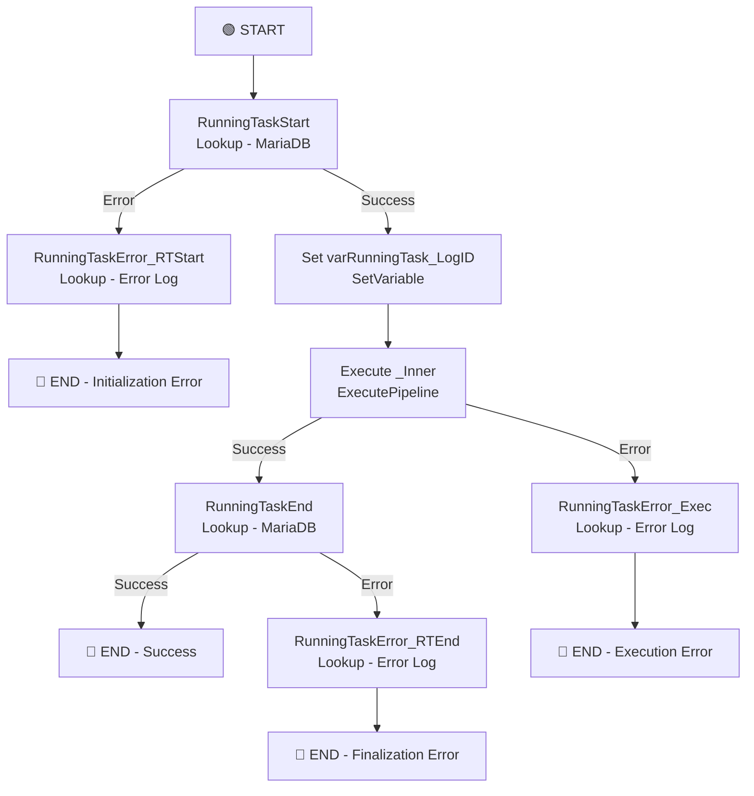

# PL_IntgrID_InventoryAdjustment_Sync_M3ToD365

## 1. Vue d'ensemble

### 1.1 Nom du pipeline

`PL_IntgrID_InventoryAdjustment_Sync_M3ToD365`

### 1.2 Objectif

Pipeline maître qui orchestre l'intégration complète des ajustements de stocks (Inventory Adjustments) depuis Infor M3 vers Dynamics 365. Ce pipeline gère le cycle de vie complet de la synchronisation : initialisation du logging, appel du pipeline interne, enregistrement de fin, et gestion centralisée des erreurs avec notification à la base de données MariaDB.

### 1.3 Contexte d'exécution

- **Mode** : Orchestration maître avec gestion de tâche
- **Déclenchement** : Via triggers planifiés ou manuels
- **Appel enfant** : Exécute `PL_IntgrID_InventoryAdjustment_Sync_M3ToD365_Inner` en mode synchrone (`waitOnCompletion: true`)
- **Logging** : Enregistrement du démarrage, fin et erreurs dans table MariaDB `management.SP_RunningTaskStart`, `SP_RunningTaskEnd`, `SP_RunningTaskErrorSynapse`
- **Gestion d'erreurs** : Trois niveaux de capture (démarrage, exécution interne, fin)

### 1.4 Cycle de vie des données

1. **Initialisation** : 
   - Enregistrement du démarrage dans MariaDB (table management)
   - Récupération du LogID unique
2. **Transmission au pipeline interne** :
   - Appel synchrone du pipeline Inner
   - Passage des paramètres SFTP, ADLS, et contexte tâche
3. **Traitement** : 
   - Traitement des fichiers d'ajustement (géré par Inner)
   - Transformation et charge vers D365
4. **Finalisation** :
   - Enregistrement de fin de tâche en MariaDB
   - Statut succès/erreur synchronisé
5. **Gestion d'erreurs centralisée** :
   - Erreurs de démarrage : non-disponibilité MariaDB, erreur authentification
   - Erreurs d'exécution : propagées du pipeline interne
   - Erreurs de finalisation : problèmes de logging

---

## 2. Architecture du pipeline

### 2.1 Flux d'exécution principal

---

## 3. Activités à haut niveau

| # | Nom de l'activité | Type | Rôle | Dépendance |
|---|---|---|---|---|
| 1 | RunningTaskStart | Lookup | Enregistre le démarrage de la tâche dans MariaDB et récupère LogID | - |
| 2 | RunningTaskError_RTStart | Lookup | Logging des erreurs lors du démarrage (MariaDB error handler) | RunningTaskStart (Failed) |
| 3 | Set varRunningTask_LogID | SetVariable | Capture LogID retourné par RunningTaskStart pour tracking | RunningTaskStart (Success) |
| 4 | Execute _Inner | ExecutePipeline | Appel synchrone du pipeline interne pour synchronisation des ajustements | Set varRunningTask_LogID |
| 5 | RunningTaskError_Exec | Lookup | Logging des erreurs d'exécution du pipeline interne | Execute _Inner (Failed) |
| 6 | RunningTaskEnd | Lookup | Enregistre la fin de la tâche en MariaDB (succès) | Execute _Inner (Success) |
| 7 | RunningTaskError_RTEnd | Lookup | Logging des erreurs lors de la finalisation | RunningTaskEnd (Failed) |

---

## 4. Variables

| Variable | Type | Description |
|---|---|---|
| varRunningTask_LogID | String | ID unique de la tâche en cours (récupéré via RunningTaskStart, transmis au pipeline interne et utilisé pour logging d'erreurs) |

---

## 5. Paramètres

| Paramètre | Type | Valeur par défaut | Description |
|---|---|---|---|
| sftpPath | string | `SyncInforToAzure/` | Chemin racine SFTP - transmis au pipeline interne |
| ProcessedPath | string | `Archive/` | Sous-chemin pour archivage - transmis au pipeline interne |
| ErrorPath | string | `Error/` | Sous-chemin pour erreurs - transmis au pipeline interne |
| EntityName | string | `InventoryAdjustment` | Nom de l'entité - transmis au pipeline interne |
| adlsContainerName | string | `integration` | Conteneur ADLS - transmis au pipeline interne |
| adlsProcessFilesPath | string | `ToD365/Landing/` | Chemin ADLS - transmis au pipeline interne |

---

## 6. Flux de données

| Source | Destination | Technologie | Type de données |
|---|---|---|---|
| Pipeline (métadonnées) | MariaDB | Lookup (SP_RunningTaskStart) | LogID, timestamp de démarrage |
| Pipeline Inner | Parent | ExecutePipeline | Statut succès/erreur du traitement |
| Erreurs | MariaDB | Lookup (SP_RunningTaskErrorSynapse) | Logs d'erreur structurés |

---

## 7. Champs mappés

### Passage de paramètres au pipeline interne

Le pipeline maître transmet les paramètres suivants au pipeline `PL_IntgrID_InventoryAdjustment_Sync_M3ToD365_Inner` :

| Paramètre maître | Paramètre interne | Type |
|---|---|---|
| sftpPath | sftpPath | Expression |
| ProcessedPath | ProcessedPath | Expression |
| ErrorPath | ErrorPath | Expression |
| EntityName | EntityName | Expression |
| adlsContainerName | adlsContainerName | Expression |
| adlsProcessFilesPath | adlsProcessFilesPath | Expression |
| varRunningTask_LogID | RunningTask_LogID | Variable (SetVariable) |
| pipeline().Pipeline | RunningTask_TaskName | Expression |

---

## 8. Chemins et emplacements

| Chemin | Type | Utilisation |
|---|---|---|
| MariaDB (management) | Database | Logging des tâches (table RunningTasks) |
| `SyncInforToAzure/InventoryAdjustment/` | SFTP | Réception des fichiers (paramétrisé, transmis au pipeline interne) |
| `SyncInforToAzure/Error/InventoryAdjustment/{YYYYMM}/` | SFTP | Stockage des fichiers en erreur (paramétrisé) |
| `integration/ToD365/Landing/InventoryAdjustment/` | ADLS | Fichiers intermédiaires et listes (paramétrisé) |

---

## 9. Notes complémentaires

### 🔍 Points clés d'attention

1. **Architecture maître-détail** : Ce pipeline joue le rôle de chef d'orchestre
   - Responsable du logging centralisé
   - Gère le cycle de vie complet de la tâche
   - Transmet les paramètres au pipeline interne
   - Capture et enregistre les erreurs

2. **Logging distribué** : Trois points de log distincts en MariaDB
   - `SP_RunningTaskStart` : Initialisation (timestamp, user, status)
   - `SP_RunningTaskEnd` : Finalisation (statut succès/erreur)
   - `SP_RunningTaskErrorSynapse` : Erreurs détaillées avec contexte

3. **Synchronisation obligatoire** : `waitOnCompletion: true`
   - Le pipeline maître attend la fin du pipeline interne
   - Les erreurs du pipeline interne propagent au maître
   - Permet la gestion d'erreur en cascade

4. **Paramètres transmis en intégralité** : Tous les paramètres du maître sont relayés au pipeline interne
   - Permet la configuration centralisée au niveau maître
   - Pipeline interne reste réutilisable (pas de dépendances hardcodées)

5. **Gestion d'erreur à trois niveaux** :
   - Niveau 1 (RunningTaskStart) : Erreur d'initialisation
   - Niveau 2 (Execute _Inner) : Erreurs du traitement
   - Niveau 3 (RunningTaskEnd) : Erreur de finalisation

### ⚠️ Remarques de conception

1. **Dépendance MariaDB obligatoire** : Le pipeline échoue si MariaDB n'est pas accessible au démarrage
2. **LogID non réutilisé après fin** : Le LogID est utilisé uniquement pour linking vers pipeline interne et logging d'erreurs
3. **Pas de redémarrage automatique** : Aucune logique de retry configurée (timeout = 30s par défaut)
4. **Pas de tronçature timeout ExecutePipeline** : Le timeout du pipeline interne n'est pas limité - hérité du contexte d'exécution

### 🚀 Recommandations d'amélioration

1. **Ajouter Retries** :
   - RunningTaskStart : retry de 2-3 fois (peut être temporaire)
   - Execute _Inner : inherit du pipeline interne (pas d'override nécessaire)

2. **Enrichir le logging** :
   - Ajouter timestamp de fin réelle (vs enregistrement de fin)
   - Capturer la durée d'exécution du pipeline interne
   - Ajouter métriques de volume (fichiers, enregistrements)

3. **Ajouter notifications** :
   - Email sur erreur (notamment niveau 1 et 3)
   - Alerte si duration > SLA

4. **Gestion de statut** :
   - Distinguer les erreurs "soft" (warnings) vs "hard" (blocking)
   - Permettre une escalade progressive des alertes

5. **Documentation des erreurs** :
   - Mapper les codes d'erreur MariaDB à des actions correctives
   - Créer runbook pour erreurs courantes

### 📊 SLA et monitoring

- **Expected duration** : Dépend du volume de fichiers et du pipeline interne (généralement < 2h)
- **Critical errors** : Non-disponibilité SFTP, chemin invalide, D365 inaccessible
- **Warnings** : Fichiers partiellement échoués, durée > SLA
- **Idempotence** : Relance possible si le pipeline interne supporte la relance (dépend de DF_D365_InventoryAdjustment_Sync)
