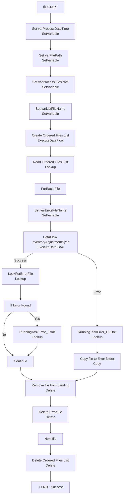

# PL_IntgrID_InventoryAdjustment_Sync_M3ToD365_Inner

## 1. Vue d'ensemble

### 1.1 Nom du pipeline

`PL_IntgrID_InventoryAdjustment_Sync_M3ToD365_Inner`

### 1.2 Objectif

Pipeline interne qui orchestre la synchronisation des ajustements de stocks (Inventory Adjustments) depuis Infor M3 vers Dynamics 365. Ce pipeline traite les fichiers JSON reçus via SFTP en les transformant et les chargeant dans D365 via DataFlow, avec gestion complète des erreurs et archivage des fichiers traités.

### 1.3 Contexte d'exécution

- **Mode** : Synchronisation delta/full load des mouvement de stocks
- **Déclenchement** : Appelé depuis le pipeline maître `PL_IntgrID_InventoryAdjustment_Sync_M3ToD365`
- **Traitement** : Séquentiel, fichier par fichier via boucle ForEach
- **Gestion d'erreurs** : Capture d'erreurs DataFlow, copie vers dossier erreur, logging en base de données

### 1.4 Cycle de vie des données

1. **Réception** : Fichiers JSON stockés sur SFTP (`SyncInforToAzure/InventoryAdjustment/`)
2. **Préparation** : Création liste ordonnée des fichiers via DataFlow
3. **Traitement itératif** : Pour chaque fichier:
   - Exécution du DataFlow de transformation (`DF_D365_InventoryAdjustment_Sync`)
   - Gestion des erreurs (copie vers dossier erreur ou succès)
   - Suppression du fichier source depuis SFTP
4. **Destination** : 
   - Données valides : D365 via DataFlow (transformation)
   - Erreurs : Copie dans dossier `Error/` sur SFTP avec horodatage
   - Fichiers traités : Archivage dans `Archive/` ou suppression
5. **Nettoyage** : Suppression du fichier liste temporaire depuis ADLS

---

## 2. Architecture du pipeline

### 2.1 Flux d'exécution principal

---

## 3. Activités à haut niveau

| # | Nom de l'activité | Type | Rôle | Dépendance |
|---|---|---|---|---|
| 1 | Set varProcessDateTime | SetVariable | Initialise l'horodatage de traitement (EST) | - |
| 2 | Set varFilePath | SetVariable | Construit chemin SFTP source des fichiers | Set varProcessDateTime |
| 3 | Set varProcessFilesPath | SetVariable | Construit chemin ADLS pour fichiers en cours | Set varFilePath |
| 4 | Set varListFileName | SetVariable | Génère nom du fichier liste ordonnée | Set varProcessFilesPath |
| 5 | Create Ordered Files List | ExecuteDataFlow | Crée liste ordonnée des fichiers à traiter | Set varListFileName |
| 6 | Read Ordered Files List | Lookup | Lit la liste JSON des fichiers depuis ADLS | Create Ordered Files List |
| 7 | ForEachFile | ForEach | Itère sur chaque fichier de la liste (séquentiel) | Read Ordered Files List |
| 7.1 | Set varErrorFileName | SetVariable | Génère nom du fichier erreur | - |
| 7.2 | DataFlow InventoryAdjustmentSync | ExecuteDataFlow | Transforme et charge les ajustements vers D365 | Set varErrorFileName |
| 7.3 | RunningTaskError_DFUnit | Lookup | Logging des erreurs DataFlow en MariaDB | DataFlow (Failed) |
| 7.4 | Copy file to Error folder | Copy | Copie le fichier en erreur vers dossier erreur SFTP | RunningTaskError_DFUnit |
| 7.5 | Remove file from Landing | Delete | Supprime original depuis SFTP après copie | Copy file to Error folder |
| 7.6 | LookForErrorFile | Lookup | Recherche fichier d'erreur créé par DataFlow | DataFlow (Success) |
| 7.7 | If Error | IfCondition | Vérifie si erreurs détectées par DataFlow | LookForErrorFile |
| 7.8 | RunningTaskError_Error | Lookup | Logging des erreurs de transformations | If Error = True |
| 7.9 | Delete ErrorFile | Delete | Supprime fichier erreur depuis ADLS | If Error |
| 8 | Delete Ordered Files List | Delete | Supprime fichier liste depuis ADLS | ForEachFile |

---

## 4. Variables

| Variable | Type | Description |
|---|---|---|
| varProcessDateTime | String | Horodatage du traitement au format `yyyyMMddTHHmmss` (Eastern Standard Time) |
| varFilePath | String | Chemin SFTP source des fichiers à traiter (`SyncInforToAzure/InventoryAdjustment/`) |
| varProcessFilesPath | String | Chemin ADLS pour stockage des fichiers en cours de traitement (`ToD365/Landing/InventoryAdjustment/`) |
| varListFileName | String | Nom du fichier JSON contenant la liste ordonnée des fichiers (ex: `InventoryAdjustment20240812T143651.json`) |
| varErrorFileName | String | Nom du fichier d'erreur générée par DataFlow (ex: `InventoryAdjustment_Error_20240812T143651.json`) |

---

## 5. Paramètres

| Paramètre | Type | Valeur par défaut | Description |
|---|---|---|---|
| sftpPath | string | `SyncInforToAzure/` | Chemin racine SFTP pour réception des fichiers |
| ProcessedPath | string | `Archive/` | Sous-chemin SFTP pour l'archivage des fichiers traités |
| ErrorPath | string | `Error/` | Sous-chemin SFTP pour les fichiers en erreur |
| EntityName | string | `InventoryAdjustment` | Nom de l'entité (utilisé dans les chemins et noms de fichiers) |
| adlsContainerName | string | `integration` | Nom du conteneur ADLS où stocker les fichiers intermédiaires |
| adlsProcessFilesPath | string | `ToD365/Landing/` | Chemin de base ADLS pour les fichiers en cours de traitement |
| RunningTask_LogID | string | `0` | ID du log de tâche (reçu du pipeline maître) |
| RunningTask_TaskName | string | `PL_IntgrID_InventoryAdjustment_Sync_M3ToD365` | Nom de la tâche pour logging |

---

## 6. Flux de données

| Source | Destination | Technologie | Type de données |
|---|---|---|---|
| SFTP (M3) | ADLS (Intermediate) | DataFlow (`DF_SFTP_OrderedFilesList`) | JSON (liste de fichiers) |
| SFTP (M3) | DataFlow | SFTP Read | JSON (ajustements de stocks) |
| DataFlow | D365 | DataFlow (paramétré) | Documents ajustements de stocks D365 |
| SFTP | SFTP (Error path) | Copy Activity | JSON (fichiers en erreur) |
| ADLS | ADLS | DataFlow/Lookup | JSON (états d'erreur) |

---

## 7. Champs mappés

### Flux principal (DataFlow DF_D365_InventoryAdjustment_Sync)

Le DataFlow transforme les ajustements de stocks M3 selon la structure D365:
- **Entrée SFTP** : Fichiers JSON d'ajustements M3
- **Transformation** : Mapping de champs M3 → D365, enrichissement avec contexte entrepôt
- **Sortie D365** : Documents `InventoryAdjustment` en D365
- **Sortie erreur ADLS** : Fichier JSON contenant les enregistrements non conformes

### Paramètres DataFlow

- `df_FilePath`: Chemin SFTP source
- `df_ProcessedPath`: Chemin SFTP destination après succès
- `df_ErrorFileName`: Nom du fichier erreur en ADLS

---

## 8. Chemins et emplacements

| Chemin | Type | Utilisation | Format |
|---|---|---|---|
| `SyncInforToAzure/InventoryAdjustment/` | SFTP | Source - Réception des fichiers JSON M3 | JSON |
| `SyncInforToAzure/Error/InventoryAdjustment/{YYYYMM}/` | SFTP | Destination erreur - Fichiers échoués | JSON (renamed avec RunId) |
| `SyncInforToAzure/Archive/InventoryAdjustment/{YYYYMM}/` | SFTP | Destination succès - Archivage (optionnel) | JSON |
| `integration/ToD365/Landing/InventoryAdjustment/` | ADLS | Stockage liste fichiers et fichiers erreur | JSON |
| D365 (via DataFlow) | D365 | Destination finale - Tables InventoryAdjustment | Entités D365 |

---

## 9. Notes complémentaires

### 🔍 Points clés d'attention

1. **Exécution séquentielle** : Les fichiers sont traités un par un (`isSequential: true`) pour éviter les contentions
2. **Gestion erreurs multicouches** :
   - Erreurs DataFlow : catchées avec `dependencyConditions: Failed`
   - Erreurs transformation : détectées dans fichier `*_Error_*.json`
   - Logging centralisé : `management.SP_RunningTaskErrorSynapse` en MariaDB
3. **Archivage condititionnel** : 
   - Succès : Suppression du fichier source, fichier liste nettoyé
   - Erreur : Copie en dossier erreur avec horodatage unique (RunId)
4. **Dépendance chaîne** : Le pipeline ne démarrera que si **toutes** les étapes précédentes réussissent (par défaut `Succeeded`)

### ⚠️ Remarques de conception

1. **Chemin horodaté par mois** : Les erreurs et archives se classent par `{YYYYMM}` pour faciliter la rétention et l'audit
2. **Timeout DataFlow** : 1 heure configurée (`0.01:00:00`) - peut être insuffisant pour grands volumes
3. **Fichier liste = interface** : Permet le tri/ordonnancement des fichiers avant traitement (ordre d'exécution maîtrisé)
4. **Nettoyage obligatoire** : Suppression du fichier liste à la fin évite l'accumulation d'artefacts ADLS

### 🚀 Recommandations d'amélioration

1. **Ajouter un Try-Catch global** : Actuellement, un échec non géré peut laisser le pipeline en état inconsistent
2. **Paramétrer les timeouts** : Les valeurs actuelles (10min, 1h, 30sec) sont hardcodées - considérer les passer en paramètres
3. **Logging détaillé** : Enrichir les logs avec métriques (nombre de fichiers traités, volume données, durée)
4. **Notification d'erreur** : Ajouter une alerte (email, Teams) lors d'erreurs DataFlow
5. **Idempotence** : Vérifier que relancer le pipeline n'introduira pas de doublons en D365

### 📊 Métriques suggérées

- Nombre de fichiers traités par exécution
- Taux de succès/erreur
- Volume de données transformées
- Durée moyenne de traitement par fichier
- Erreurs par type (validation, transformation, API)
