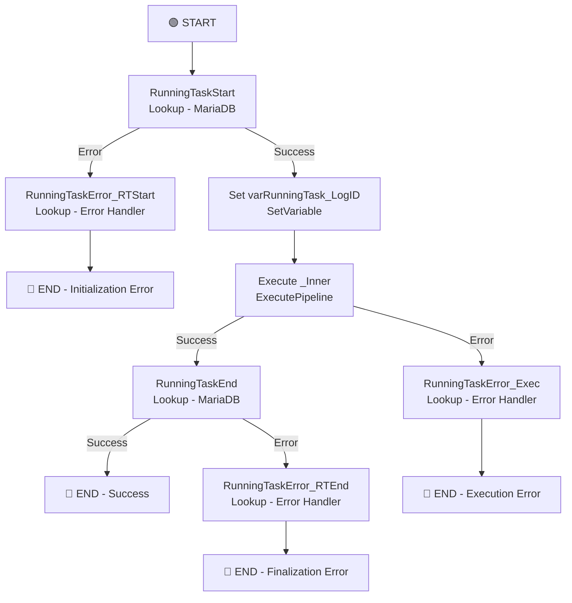

# PL_IntgrID_InventoryReconciliation_M3ToD365

## 1. Vue d'ensemble

### 1.1 Nom du pipeline

`PL_IntgrID_InventoryReconciliation_M3ToD365`

### 1.2 Objectif

Pipeline maître qui orchestre la réconciliation complète des stocks entre Infor M3 et Dynamics 365. Ce pipeline gère le cycle de vie complet : initialisation du logging en MariaDB, appel du pipeline interne pour réconciliation par entrepôt, enregistrement de fin, et gestion centralisée des erreurs avec notifications à la base de données.

### 1.3 Contexte d'exécution

- **Mode** : Orchestration maître avec gestion de tâche et logging
- **Déclenchement** : Via triggers planifiés ou manuels
- **Appel enfant** : Exécute `PL_IntgrID_InventoryReconciliation_M3ToD365_Inner` en mode synchrone (`waitOnCompletion: true`)
- **Logging** : Enregistrement du démarrage, fin et erreurs dans MariaDB (procedures SP_RunningTaskStart, SP_RunningTaskEnd, SP_RunningTaskErrorSynapse)
- **Gestion d'erreurs** : Trois niveaux de capture (démarrage, exécution interne, fin)
- **Paramètres** : Transmission optionnelle d'identifiant d'entrepôt au pipeline interne (renouvellement de token optionnel)

### 1.4 Cycle de vie des données

1. **Initialisation** : 
   - Enregistrement du démarrage en MariaDB
   - Récupération LogID unique pour tracking
2. **Transmission au pipeline interne** :
   - Appel synchrone du pipeline Inner
   - Transmission du paramètre Warehouse (optionnel) et flag renouvellement token
3. **Traitement** : 
   - Réconciliation des stocks par entrepôt (géré par Inner)
   - Comparaison M3 vs D365
   - Génération des ajustements
4. **Finalisation** :
   - Enregistrement de fin de tâche en MariaDB
   - Synchronisation du statut succès/erreur
5. **Gestion d'erreurs centralisée** :
   - Erreurs d'initialisation (MariaDB indisponible)
   - Erreurs d'exécution (pipeline interne)
   - Erreurs de finalisation (logging échoue)

---

## 2. Architecture du pipeline

### 2.1 Flux d'exécution principal



---

## 3. Activités à haut niveau

| # | Nom de l'activité | Type | Rôle | Dépendance |
|---|---|---|---|---|
| 1 | RunningTaskStart | Lookup | Enregistre le démarrage de tâche en MariaDB, retourne LogID | - |
| 2 | RunningTaskError_RTStart | Lookup | Logging d'erreur lors du démarrage (MariaDB) | RunningTaskStart (Failed) |
| 3 | Set varRunningTask_LogID | SetVariable | Capture le LogID pour transmission au pipeline interne | RunningTaskStart (Success) |
| 4 | Execute _Inner | ExecutePipeline | Appel synchrone du pipeline interne pour réconciliation | Set varRunningTask_LogID |
| 5 | RunningTaskError_Exec | Lookup | Logging d'erreur d'exécution du pipeline interne | Execute _Inner (Failed) |
| 6 | RunningTaskEnd | Lookup | Enregistre la fin de tâche en MariaDB (succès) | Execute _Inner (Success) |
| 7 | RunningTaskError_RTEnd | Lookup | Logging d'erreur lors de la finalisation | RunningTaskEnd (Failed) |

---

## 4. Variables

| Variable | Type | Description |
|---|---|---|
| varRunningTask_LogID | String | ID unique de la tâche en cours (récupéré via RunningTaskStart, transmis au pipeline interne pour tracking et logging d'erreurs) |

---

## 5. Paramètres

| Paramètre | Type | Valeur par défaut | Description |
|---|---|---|---|
| ForceRenewInforApiBearerToken | bool | `false` | Force le renouvellement du bearing token Infor (optionnel, transmis au pipeline interne) |
| Warehouse | string | (vide) | ID ou code d'entrepôt optionnel pour filtrer le traitement (transmis au pipeline interne) |

---

## 6. Flux de données

| Source | Destination | Technologie | Type de données |
|---|---|---|---|
| Pipeline (métadonnées) | MariaDB | Lookup (SP_RunningTaskStart) | LogID, timestamp, pipeline name |
| Pipeline Inner | Parent | ExecutePipeline | Statut succès/erreur du traitement |
| Erreurs | MariaDB | Lookup (SP_RunningTaskErrorSynapse) | Error details, pipeline context |

---

## 7. Champs mappés

### Passage de paramètres au pipeline interne

Le pipeline maître transmet les paramètres suivants à `PL_IntgrID_InventoryReconciliation_M3ToD365_Inner` :

| Paramètre maître | Paramètre interne | Type | Source |
|---|---|---|---|
| ForceRenewInforApiBearerToken | ForceRenewInforApiBearerToken | Expression | Paramètre du maître |
| varRunningTask_LogID | RunningTask_LogID | Variable | SetVariable |
| pipeline().Pipeline | RunningTask_TaskName | Expression | Context dynamic |
| Warehouse | Warehouse | Expression | Paramètre du maître |

### Requête MariaDB - RunningTaskStart

Procédure stockée : `management.SP_RunningTaskStart`
```sql
CALL management.SP_RunningTaskStart(
  'PL_IntgrID_InventoryReconciliation_M3ToD365',  -- pipeline name
  '0'                                             -- initial status
)
```

**Retour** : Première colonne = LogID (numérique)

### Requête MariaDB - RunningTaskEnd

Procédure stockée : `management.SP_RunningTaskEnd`
```sql
CALL management.SP_RunningTaskEnd(
  'PL_IntgrID_InventoryReconciliation_M3ToD365',  -- pipeline name
  '<varRunningTask_LogID>'                        -- unique log id
)
```

---

## 8. Chemins et emplacements

| Chemin | Type | Utilisation |
|---|---|---|
| MariaDB (management) | Database | Logging des tâches de réconciliation |
| D365 | Database | Source entrepôts, destination ajustements |
| Infor M3 API | REST | Source données stocks |
| Azure Key Vault | Service | Stockage bearer token |

---

## 9. Notes complémentaires

### 🔍 Points clés d'attention

1. **Architecture maître-détail robuste** :
   - Ce pipeline maître = chef d'orchestre
   - Responsable du cycle de vie complet
   - Centralise le logging et la gestion d'erreurs
   - Pipeline interne reste réutilisable et testable

2. **Logging distribué en MariaDB** :
   - `SP_RunningTaskStart` : Timestamp de démarrage, user context
   - `SP_RunningTaskEnd` : Timestamp de fin, statut succès
   - `SP_RunningTaskErrorSynapse` : Détails erreur avec contexte pipeline

3. **Synchronisation obligatoire** : `waitOnCompletion: true`
   - Le pipeline maître attend la fin du pipeline interne
   - Les erreurs du pipeline interne propagent au maître
   - Permet la gestion d'erreur en cascade et le logging centralisé

4. **Paramètres optionnels** :
   - `ForceRenewInforApiBearerToken` : Par défaut false (utilise token en cache)
   - `Warehouse` : Par défaut vide (traite tous les entrepôts avec pattern T*)
   - Permettent des lancements partiels ou avec configurations spécifiques

5. **Gestion d'erreur à trois niveaux** :
   - **Niveau 1 (RunningTaskStart)** : Erreur d'initialisation (MariaDB, authentification)
   - **Niveau 2 (Execute _Inner)** : Erreurs du traitement (API, D365, transformation)
   - **Niveau 3 (RunningTaskEnd)** : Erreur de finalisation (logging échoue après succès)

### ⚠️ Remarques de conception

1. **Dépendance MariaDB obligatoire** : 
   - Le pipeline échoue immédiatement si MariaDB n'est pas accessible
   - Aucun fallback ou retry configuré
   - Timeout = 30 secondes par défaut

2. **Pas de retry automatique** :
   - Aucune stratégie de retry configurée sur RunningTaskStart
   - Erreur réseau peut bloquer le démarrage

3. **Pipeline interne non-limité en timeout** :
   - Execute _Inner hérite du timeout du contexte d'exécution (très long)
   - Pas de limite explicite

4. **LogID implicitement sérialisé** :
   - Même LogID utilisé pour tous les entrepôts dans l'exécution
   - Permet de relier tous les entrepôts à une seule exécution de tâche

### 🚀 Recommandations d'amélioration

1. **Ajouter Retries sur RunningTaskStart** :
   ```json
   "policy": {
     "retry": 2,
     "retryIntervalInSeconds": 15,
     "timeout": "0.00:00:30"
   }
   ```
   Justification : Les erreurs réseau sont transitoires

2. **Enrichir le logging** :
   - Ajouter timestamp de fin réelle (vs enregistrement)
   - Capturer la durée d'exécution du pipeline interne
   - Logger le nombre d'entrepôts traités, volume de données
   - Distinguer les warnings des errors

3. **Ajouter notifications** :
   - Email sur Niveau 1 Error (bloque la réconciliation)
   - Alerte Teams si duration > SLA
   - Dashboard Power BI pour tracking du pipeline

4. **Gestion de statut granulaire** :
   - Distinguer "partial success" (certains entrepôts échouent) vs "full success"
   - Escalade progressive des alertes (warning → critical)
   - Runbook pour actions correctives par type d'erreur

5. **Monitoring et observabilité** :
   - Métriques : nombre d'entrepôts, durée par entrepôt, volume données
   - Anomaly detection sur durée d'exécution
   - Alertes sur patterns d'erreur (même erreur = cause systémique)

6. **Idempotence** :
   - Vérifier si relancer le pipeline provoque des doublons en D365
   - Documenter si les ajustements stocks sont idempotents
   - Si non-idempotent, implémenter un mécanisme de détection de doublons

### 📊 SLA et monitoring suggéré

| Métrique | Seuil | Action |
|---|---|---|
| **Duration** | < 1h | Normal |
| **Duration** | 1h - 2h | Warning |
| **Duration** | > 2h | Critical |
| **Error Rate** | 0% | Expected |
| **Error Rate** | 1-10% | Warning (partial success) |
| **Error Rate** | > 10% | Critical (most entrepôts failed) |
| **RunningTaskStart latency** | < 2s | Normal |
| **RunningTaskStart latency** | > 5s | Warning (MariaDB slow) |

### 🔐 Considérations de sécurité

- Pas de secrets stockés en dur dans le pipeline
- Bearer token Infor passé via variable (sécurisé)
- Authentification MSI pour AKV (pas de credentials en clair)
- Connexion MariaDB doit être TLS
- Logs d'erreur ne doivent pas exposer données sensibles
- Audit trail : QUI a lancé le pipeline via RunningTaskStart (UserContext)
