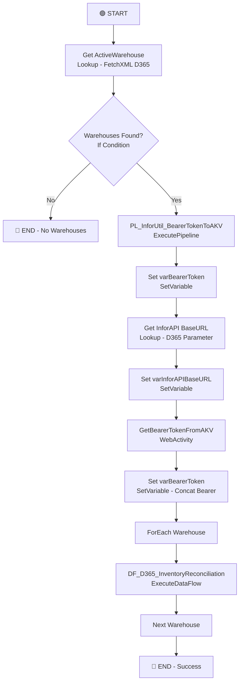

# PL_IntgrID_InventoryReconciliation_M3ToD365_Inner

## 1. Vue d'ensemble

### 1.1 Nom du pipeline

`PL_IntgrID_InventoryReconciliation_M3ToD365_Inner`

### 1.2 Objectif

Pipeline interne qui réconcilie les données de stocks entre Infor M3 et Dynamics 365 au niveau de chaque entrepôt. Ce pipeline récupère les stocks M3 via API REST, les compare avec les données D365, et exécute les transformations nécessaires pour synchroniser les stocks. Il gère l'authentification Infor via bearer token en Azure Key Vault.

### 1.3 Contexte d'exécution

- **Mode** : Réconciliation par entrepôt (optionnel - filtrable)
- **Déclenchement** : Appelé depuis le pipeline maître `PL_IntgrID_InventoryReconciliation_M3ToD365`
- **Authentification** : Token bearer Infor via Azure Key Vault
- **Traitement** : Itératif par entrepôt via boucle ForEach (séquentiel)
- **Intégration M3** : Via API REST Infor M3 (endpoint MMS060MI/LstBalID)
- **Gestion d'erreurs** : Conditionnelle (traitement seulement si entrepôts actifs trouvés)

### 1.4 Cycle de vie des données

1. **Authentification** :
   - Récupération bearer token depuis Azure Key Vault
   - Renouvellement conditionnel via pipeline `PL_InforUtil_BearerTokenToAKV`
2. **Découverte entrepôts** :
   - Requête FetchXML sur D365 entité `msdyn_warehouse`
   - Filtrage par entrepôt actif (statecode = 0)
   - Support filtrage optionnel par paramètre (wildcard LIKE ou exact EQ)
3. **Récupération M3** (pour chaque entrepôt) :
   - Appel API REST M3 `MMS060MI/LstBalID` avec paramètres CONO et WHLO
   - Transformation des données M3 via DataFlow
4. **Réconciliation** :
   - Comparaison données M3 vs D365 via DataFlow
   - Identification des écarts (surplus, manques)
   - Génération des ajustements
5. **Destination** : Mise à jour D365 (via DataFlow DF_D365_InventoryReconciliation)

---

## 2. Architecture du pipeline

### 2.1 Flux d'exécution principal



---

## 3. Activités à haut niveau

| # | Nom de l'activité | Type | Rôle | Dépendance |
|---|---|---|---|---|
| 1 | Get ActiveWarehouse | Lookup | Récupère la liste des entrepôts actifs depuis D365 (FetchXML) | - |
| 2 | If Active Warehouses Found | IfCondition | Vérification existence entrepôts (count > 0) | Get ActiveWarehouse |
| 2.1 | PL_InforUtil_BearerTokenToAKV | ExecutePipeline | Renouvellement optionnel du bearer token Infor | If = True |
| 2.2 | Get InforAPI BaseURL | Lookup | Récupère URL de base API Infor depuis paramètre D365 | PL_InforUtil_BearerTokenToAKV |
| 2.3 | Set varInforAPIBaseURL | SetVariable | Stocke l'URL de base de l'API Infor | Get InforAPI BaseURL |
| 2.4 | GetBearerTokenFromAKV | WebActivity | Récupère bearer token depuis Azure Key Vault (GET /secrets/) | PL_InforUtil_BearerTokenToAKV |
| 2.5 | Set varBearerToken | SetVariable | Formate bearer token en `Bearer <token>` | GetBearerTokenFromAKV |
| 2.6 | ForEach Warehouse | ForEach | Itère sur liste d'entrepôts (séquentiel) | Set varBearerToken |
| 2.6.1 | DF_D365_InventoryReconciliation | ExecuteDataFlow | Exécute réconciliation par entrepôt (M3 API + D365) | - |
| 3 | End (Success) | - | Pipeline termine avec succès | ForEach Warehouse ou If = False |

---

## 4. Variables

| Variable | Type | Description |
|---|---|---|
| varBearerToken | String | Bearer token Infor authentifié au format `Bearer <token_value>` (originellement sans `Bearer`, ajouté lors de Set varBearerToken final) |
| varInforAPIBaseURL | String | URL de base de l'API Infor M3 (ex: `https://inforapi.company.com/`) |

---

## 5. Paramètres

| Paramètre | Type | Valeur par défaut | Description |
|---|---|---|---|
| ForceRenewInforApiBearerToken | bool | `false` | Force le renouvellement du bearing token Infor (contourne le cache AKV) |
| RunningTask_LogID | string | `0` | ID du log de tâche (reçu du pipeline maître pour tracking) |
| RunningTask_TaskName | string | `PL_IntgrID_InventoryReconciliation_M3ToD365` | Nom de la tâche pour logging (reçu du pipeline maître) |
| Warehouse | string | (vide) | Filtrage optionnel d'entrepôt (si vide = LIKE 'T%', sinon EQ avec valeur donnée) |

---

## 6. Flux de données

| Source | Destination | Technologie | Type de données |
|---|---|---|---|
| D365 | Lookup | FetchXML | Métadonnées entrepôts (ava_warehouseinforid, statecode) |
| Azure Key Vault | WebActivity | REST API | Bearer token Infor |
| D365 | Lookup | FetchXML | Paramètre InforAPIBaseURL |
| Infor M3 API | DataFlow | REST API | Stocks par entrepôt (MMS060MI/LstBalID) |
| DataFlow | D365 | DataFlow (custom) | Ajustements stocks réconciliés |

---

## 7. Champs mappés

### Requête FetchXML - Get ActiveWarehouse

```xml
<fetch version="1.0" output-format="xml-platform" mapping="logical">
  <entity name="msdyn_warehouse">
    <attribute name="ava_warehouseinforid"/>
    <order attribute="ava_warehouseinforid" descending="false"/>
    <filter type="and">
      <condition attribute="ava_warehouseinforid" 
                 operator="DYNAMIC_LIKE_OR_EQ" 
                 value="DYNAMIC_WAREHOUSE_FILTER"/>
      <condition attribute="statecode" operator="eq" value="0"/>
    </filter>
  </entity>
</fetch>
```

**Dynamique**:
- Si `Warehouse` est vide : `operator="like"`, `value="T%"` (entrepôts commençant par T)
- Si `Warehouse` rensigné : `operator="eq"`, `value="{Warehouse}"` (entrepôt spécifique)

### Paramètres DataFlow DF_D365_InventoryReconciliation

| Paramètre DataFlow | Source | Description |
|---|---|---|
| df_Warehouse | item().ava_warehouseinforid | ID de l'entrepôt courant (itération ForEach) |
| df_BearerToken | variables('varBearerToken') | Bearer token fourni au DataFlow |

### Paramètres Dataset DataFlow

| Dataset | Paramètre | Source | Description |
|---|---|---|---|
| M3WarehouseProductInventory | APIUrl | Expression dynamique | URL API Infor : `/M3/m3api-rest/v2/execute/MMS060MI/LstBalID` + params CONO + WHLO |

**Example d'URL générée**:
```
https://inforapi.company.com/M3/m3api-rest/v2/execute/MMS060MI/LstBalID?CONO=100&WHLO=T01&maxrecs=0
```

---

## 8. Chemins et emplacements

| Chemin | Type | Utilisation | Format |
|---|---|---|---|
| D365 | Database | Source entrepôts actifs (entité msdyn_warehouse) | Entités D365 |
| Azure Key Vault | Service | Stockage du bearer token Infor | Secret (string) |
| Infor M3 API | REST | Source données stocks par entrepôt | JSON (M3 API response) |
| D365 | Database | Destination ajustements stocks | Entités D365 (via DataFlow) |

---

## 9. Notes complémentaires

### 🔍 Points clés d'attention

1. **Authentification en deux étapes** :
   - Pipeline enfant `PL_InforUtil_BearerTokenToAKV` renouvelle le token si nécessaire
   - WebActivity récupère le token depuis AKV avec authentification MSI
   - Token est attaché en header HTTP `Authorization: Bearer <token>`

2. **Filtrage d'entrepôt flexible** :
   - Sans paramètre Warehouse : traite tous les entrepôts avec pattern `T*` (Tracking)
   - Avec paramètre Warehouse : traite un seul entrepôt spécifié
   - Permet les lancements partiels pour troubleshooting

3. **Exécution itérative synchrone** :
   - ForEach ne parallélise pas (`isSequential: true`)
   - Chaque entrepôt est traité séquentiellement
   - Réduit la charge API Infor et D365

4. **Gestion erreurs implicite** :
   - Pas de try-catch explicite
   - Si GetActiveWarehouse échoue : pipeline échoue
   - Si aucun entrepôt trouvé : pipeline termine normalement (sans traitement)

5. **Configuration d'API Infor dynamique** :
   - BaseURL stockée dans paramètre D365 (ava_parameter.ava_value)
   - Permet les changements sans redéployer le pipeline
   - CONO et WHLO injected dynamiquement

### ⚠️ Remarques de conception

1. **Sécurité Token** :
   - `secureOutput: true` sur WebActivity (token masqué dans logs)
   - `secureInput: false` car aucun input sensible attendu
   - Bearer token renvoyé de AKV est immédiatement masqué

2. **SetVariable redondante** :
   - Deux `Set varBearerToken` : première sans "Bearer", seconde la concatène
   - Raison : GetBearerTokenFromAKV retourne le token brut, WebActivity concatène avec "Bearer"

3. **Absence de timeout explicite** :
   - Lookup (Get ActiveWarehouse, Get InforAPI BaseURL) : 1 minute par défaut
   - WebActivity (GetBearerTokenFromAKV) : 1 minute par défaut
   - DataFlow (DF_D365_InventoryReconciliation) : 15 minutes

4. **Dépendance d'ordre non-linéaire** :
   - PL_InforUtil_BearerTokenToAKV et Get InforAPI BaseURL sont indépendants (dans le vrai code, l'un pourrait se faire avant l'autre)
   - L'ordre logique : Pipeline renouvellement → Get BaseURL peut sembler inversé

### 🚀 Recommandations d'amélioration

1. **Ajouter gestion erreur par entrepôt** :
   - Capturer les erreurs DataFlow par entrepôt
   - Continuer les autres entrepôts au lieu de bloquer
   - Logging d'erreur par entrepôt (quel entrepôt a échoué)

2. **Enrichir le monitoring** :
   - Ajouter métriques : nombre d'entrepôts traités, durée par entrepôt
   - Logging du nombre de stocks trouvés en M3 vs D365

3. **Optimiser le renouvellement de token** :
   - Vérifier si le token est encore valide avant renouvellement
   - Ajouter fallback si renouvellement échoue

4. **Ajouter une limite de traitement** :
   - `maxrecs=0` retourne tous les stocks (peut être très volumineux)
   - Considérer un paramètre de pagination ou limite de résultats

5. **Documenter les erreurs M3** :
   - Gérer les cas où l'API M3 retourne une erreur (entrepôt invalide, pas d'accès)
   - Mapper les codes d'erreur M3 à des actions correctives

6. **Validation des données** :
   - Vérifier que l'entrepôt retourné existe vraiment en M3 (avant appel API)
   - Valider la structure du token avant son utilisation

### 📊 SLA et monitoring

- **Expected duration** : Dépend du nombre d'entrepôts et du volume (généralement < 1h)
- **Critical errors** : 
  - AKV inaccessible → pas d'authentification
  - API Infor inaccessible → pas de réconciliation
  - D365 entrepôts non trouvés → traitement vide (normal si aucun entrepôt)
- **Warnings** : Durée DataFlow > 15 minutes (timeout)
- **Idempotence** : Relance possible (DataFlow gère les mises à jour)

### 🔐 Considérations de sécurité

- Bearer token masqué dans logs ADF
- Authentification MSI pour AKV (pas de secrets en clair)
- API Infor communicable en HTTPS uniquement (recommended)
- Permissions RBAC sur MMS060MI en M3 (par CONO/WHLO)
