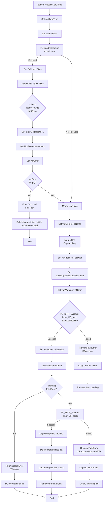

# Analyse du Pipeline Azure Data Factory

## 1. Vue d'ensemble

### 1.1 Nom du pipeline

`PL_IntgrID_Account_M3ToD365_Databricks_Inner`

### 1.2 Objectif

Ce pipeline orchestrant l'intégration des données Comptes (Account) depuis Infor M3 vers Dynamics 365 via Azure Databricks. Il réalise la fusion de fichiers JSON depuis SFTP en single file, la validation des données, puis l'exécution de deux pipelines Databricks pour le traitement et la transformation des données (identification et mise à jour des adresses de facturation).

### 1.3 Contexte d'exécution

Le pipeline supporte deux modes d'exécution :
- **FullLoad** : Chargement initial complet de tous les comptes avec validation du nombre de fichiers
- **Sync/Delta** : Synchronisation incrémentale des modifications (par défaut)

En mode FullLoad, il valide la plage de comptes non synchronisés dans M3 via une requête API Infor M3.

### 1.4 Cycle de vie des données

1. **Entrée** : Fichiers JSON individuels sur SFTP (répertoire Landing)
2. **Fusion** : Agrégation de tous les fichiers JSON en un seul fichier fusionné
3. **Validation** : Vérification du nombre de fichiers et de la plage de comptes
4. **Traitement** : Exécution des transformations via Databricks (Part 1)
5. **Mise à jour** : Exécution des mises à jour de facturation via Databricks (Part 2)
6. **Archivage** : Déplacement des fichiers traités vers Archive
7. **Nettoyage** : Suppression des fichiers intermédiaires et des listes
8. **Gestion des erreurs** : Déplacement des fichiers en erreur vers dossier Error

---

## 2. Architecture du pipeline

### 2.1 Flux d'exécution principal

---

## 3. Activités à haut niveau

| # | Nom de l'activité | Type | Rôle |
|---|---|---|---|
| 1 | Set varProcessDateTime | SetVariable | Initialise la date/heure de traitement (timestamp EST) |
| 2 | Set varSyncType | SetVariable | Détermine Full Load ou Sync basé sur paramètre |
| 3 | Set varFilePath | SetVariable | Construit le chemin SFTP pour les fichiers |
| 4 | FullLoad Validation | IfCondition | Valide les fichiers en mode Full Load |
| 5 | Get FullLoad Files | GetMetadata | Récupère la liste des fichiers dans le répertoire |
| 6 | Keep Only JSON Files | Filter | Filtre uniquement les fichiers .json |
| 7 | Get InforAPI BaseURL | Lookup | Récupère l'URL de base de l'API Infor depuis D365 |
| 8 | Set varInforAPIBaseURL | SetVariable | Stocke l'URL API récupérée |
| 9 | Get NbrAccountsNotSync | WebActivity | Interroge M3 pour le nombre de comptes non synchronisés |
| 10 | Set varError | SetVariable | Compile les messages d'erreur de validation |
| 11 | Merge json files | IfCondition | Exécute la fusion si pas d'erreur de validation |
| 12 | Set varMergeFileName | SetVariable | Génère le nom du fichier fusionné |
| 13 | Merge files | Copy | Fusionne les fichiers JSON en un seul fichier |
| 14 | Set varProcessFilesPath | SetVariable | Définit le chemin ADLS pour les fichiers de traitement |
| 15 | Set varMergedFilesListFileName | SetVariable | Génère le nom du fichier liste |
| 16 | Set varWarningFileName | SetVariable | Génère le nom du fichier d'avertissement |
| 17 | PL_SFTP_Account_Inner_DF_part1 | ExecutePipeline | Exécute le pipeline Databricks Part 1 (transformation) |
| 18 | LookForWarningFile | Lookup | Recherche les fichiers d'avertissement |
| 19 | If WarningFile | IfCondition | Gère les avertissements si présents |
| 20 | RunningTaskError_WarningForManualUpdate | Lookup | Enregistre les avertissements en base |
| 21 | PL_SFTP_Account_Inner_DF_part2 | ExecutePipeline | Exécute le pipeline Databricks Part 2 (mise à jour) |
| 22 | RunningTaskError_DFAccount | Lookup | Enregistre les erreurs Part 1 en base |
| 23 | RunningTaskError_DFAccountUpdateBillTo | Lookup | Enregistre les erreurs Part 2 en base |
| 24 | Copy file to Error folder | Copy | Déplace les fichiers en erreur vers Error/ |
| 25 | Copy file to Error folder Update Bill To | Copy | Alterne pour les erreurs Part 2 |
| 26 | Copy Merged files to Archive | Copy | Archive les fichiers fusionnés traités |
| 27 | Remove file from Landing folder | Delete | Supprime le fichier fusionné de Landing |
| 28 | Delete Merged files list | Delete | Supprime la liste des fichiers fusionnés |
| 29 | Delete WarningFile | Delete | Supprime le fichier d'avertissement d'ADLS |

---

## 4. Variables

| Variable | Type | Description |
|---|---|---|
| varProcessDateTime | String | Timestamp du traitement actuel (format : yyyyMMddTHHmmss, fuseau horaire Eastern) |
| varSyncType | String | Type de synchronisation : "FullLoad" ou "Sync" |
| varFilePath | String | Chemin SFTP complet vers les fichiers source (ex: SyncInforToAzure/Account_FullLoad/) |
| varMergeFileName | String | Nom du fichier fusionné (ex: AccountMerge_20260406T143022.json) |
| varProcessFilesPath | String | Chemin ADLS pour les fichiers de traitement |
| varWarningFileName | String | Nom du fichier d'avertissement (ex: Account_WarningManualUpdate_20260406T143022.json) |
| varWarningContent | String | Contenu du fichier d'avertissement |
| varError | String | Messages d'erreur de validation (concaténés) |
| varInforAPIBaseURL | String | URL de base pour les requêtes API Infor M3 |
| varMergedFilesListFileName | String | Nom de la liste des fichiers fusionnés (format .txt) |
| varFullLoadFilePath | String | Chemin pour les fichiers Full Load (réservé) |

---

## 5. Paramètres

| Paramètre | Type | Valeur par défaut | Description |
|---|---|---|---|
| sftpPath | string | `SyncInforToAzure/` | Chemin racine SFTP |
| ProcessedPath | string | `Archive/` | Répertoire pour archiver les fichiers traités |
| ErrorPath | string | `Error/` | Répertoire pour les fichiers en erreur |
| EntityName | string | `Account` | Nom de l'entité (fixe pour ce pipeline) |
| FullLoadPath | string | `FullLoad` | Sous-répertoire pour les Full Load |
| SyncPath | string | `Sync` | Sous-répertoire pour les synchronisations |
| adlsContainerName | string | `integration` | Conteneur ADLS principal |
| adlsProcessFilesPath | string | `ToD365/Landing/` | Chemin ADLS pour les fichiers de traitement |
| FullLoadNbrFilesRequired | int | `19` | Nombre minimum de fichiers attendus en Full Load |
| RunningTask_TaskName | string | `PL_SFTP_Account` | Nom de la tâche pour enregistrement d'erreur |
| RunningTask_LogID | string | `0` | ID du log de tâche (optionnel) |
| AccountsNotSyncMinRangeNbr | string | `690000` | Numéro de compte minimum pour validation |
| AccountsNotSyncMaxRangeNbr | string | `699999` | Numéro de compte maximum pour validation |
| isFullLoad | bool | `false` | Mode Full Load (true) ou Sync (false) |
| ForceRenewInforApiBearerToken | bool | `false` | Forcer le renouvellement du jeton Bearer |

---

## 6. Flux de données

| Source | Type | Destination | Type | Technologie |
|---|---|---|---|---|
| Fichiers JSON SFTP | JsonSource | Fichier fusionné SFTP | JsonSink | SFTP (SftpReadSettings/SftpWriteSettings) |
| D365 (Infor API BaseURL) | DynamicsSource | Variable | - | D365 Lookup Activity |
| API Infor M3 (ExecuteMI) | WebActivity | Variable | - | Bearer Token HTTP GET |
| Fichier fusionné SFTP | JsonSource | ADLS Archive | JsonSink | ADLS Gen2 (AzureBlobFSReadSettings) |
| Fichiers d'erreur SFTP | JsonSource | SFTP Error folder | JsonSink | SFTP |
| MariaDB (SP_RunningTaskErrorSynapse) | MariaDBSource | - | Logging | Stored Procedure Call |

---

## 7. Chemins et emplacements

| Chemin | Type | Description |
|---|---|---|
| `SyncInforToAzure/Account_FullLoad/` | SFTP | Source des fichiers Full Load |
| `SyncInforToAzure/Account_Sync/` | SFTP | Source des fichiers de synchronisation |
| `SyncInforToAzure/Error/Account/YYYYMM/` | SFTP | Archivage des fichiers en erreur |
| `SyncInforToAzure/Archive/Account_FullLoad/YYYYMM/MergedFiles_*/` | SFTP | Archivage des fichiers fusionnés traités |
| `integration/ToD365/Landing/Account/` | ADLS | Fichiers de traitement Databricks |
| `integration/ToD365/Landing/WarningFileName/` | ADLS | Fichiers d'avertissements de mise à jour manuelle |

---

## 8. Notes complémentaires

### Points critiques

- **Validation Full Load** : Le pipeline valide que le nombre exact de fichiers JSON est présent avant la fusion. Cette validation garantit l'intégrité du chargement complet.
- **Gestion des tokens Bearer** : Le pipeline peut forcer le renouvellement du jeton d'authentification API Infor si nécessaire.
- **Politique de retry** : Les activités Copy et WebActivity ont une politique de retry = 0 et timeout configurable (12h pour les copies, 1h pour les Web calls).
- **Avertissements manuels** : Les fichiers d'avertissement signalent des comptes nécessitant une mise à jour manuelle en D365.

### Dépendances externes

- **Base de données MariaDB** : Enregistrement des erreurs via stored procedure `SP_RunningTaskErrorSynapse`
- **Azure Key Vault** : Récupération du jeton Bearer Infor API
- **API Infor ERPN (M3)** : Requête EXPORTMI/SelectPad pour validation des comptes
- **Dynamics 365** : Lookup des paramètres (InforAPIBaseURL)
- **Databricks** : Deux pipelines enfants pour transformation et mise à jour (PL_IntgrID_Account_M3ToD365_Databricks_Part1 et Part2)

### Sécurité

- Utilisation de **MSI (Managed Identity)** pour l'authentification Azure Key Vault
- Les tokens Bearer sont marqués comme `secureOutput: false` mais transitent via HTTPS
- Les activités n'utilisent pas `secureInput: true`, à vérifier selon les besoins de sécurité

### Optimisations recommandées

1. **Nommage des activités** : Consolider les copies/suppressions en erreur avec des conventions de nommage plus cohérentes
2. **Gestion des listes de fichiers** : Valider que le fichier `.txt` des merged files est correctement généré par Databricks
3. **Monitoring** : Implémenter des alertes sur les erreurs validation et les avertissements en masse
4. **Timeout** : Le timeout 12h pour Copy Merged files to Archive peut être ajusté selon le volume initial
